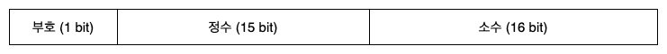

# 고정 소수점 & 부동 소수점

컴퓨터는 실수를 표현하기 위해 두 가지 방법을 사용할 수 있다.

<b>고정 소수점</b>과 <b>부동 소수점</b> 표기 방식이다.

## 고정 소수점 (Fixed Point) 표기법

<b>고정 소수점 표기법의 경우, 소수점이 찍힐 위치를 미리 정해놓고 소수를 표현하는 방식</b>이다.

가령, -3.141592는 부호(-)와 정수부(3), 소수부(0.141592)의 3 가지 요소가 필요하다.

32 bit를 기준으로 한 예시이다. 맨 앞에 있는 한 칸은 부호 비트(Sign Bit)로 1 bit의 공간을 할당한다. 0은 양수를, 1은 음수를 의미한다. 그 다음 15 칸은 정수를 표현하는 정수부, 그리고 그 이후의 16칸은 소수(소수점 이후의 실수)를 표현하는 소수부로 설정하였다. (소수점의 위치를 중앙으로 고정하여, 앞을 정수부 뒤를 소수부로 채운 것이다.)

위 그림에서 경계는 필요에 의해서 왔다갔다 할 수 있기는 하다.

 

고정 소수점 방식의 장단점은 다음과 같다.

* 장점 : 실수를 정수부와 소수부로 표현하여 단순하다.
* 단점 : 표현의 범위가 너무 적어서 활용하기 힘들다. (정수부는 15bit, 소수부는 16bit)

 

위 그림을 보면 정수는 15개의 크기로 표현할 수 있는 값만 정수로 표현할 수 있다. -2^14 ~ 2^14 - 1 범위 안에 있는 정수를 표현할 수 있겠다. 그리고 그 안에서 소수점은 16자리까지 표현할 수 있다.

고정 소수점으로 하면 내가 표현하고자 하는 숫자에 대해서는 오차 없이 표현할 수 있다.

But, <u>숫자의 범위가 너무 제한적</u>이다.

자바의 float, double을 생각해봤을 때, 이 자료형들이 표현할 수 있는 숫자의 범위는 위 그림의 범위를 한참 넘어선다. (심지어 int형이 더 범위가 크다.) 이유는, <b>float, double 자료형의 경우 부동 소수점 표기 방식을 취하고 있기 때문</b>이다. 

 

## 부동 소수점 (Floating Point) 표기법

부동 소수점의 '부동(浮動)'은 '둥둥 떠다녀서 왔다갔다 한다'는 의미이다. 즉 소수점이 유동적이라는 의미이다.

IEEE 754는 전기 전자 기술자 협회(IEEE)에서 개발한 컴퓨터에서 부동 소수점을 표현하는 가장 보편화된 표준이다.

<b>부동 소수점 표기 방법은 소수점의 위치를 고정시켜 표현하는 방식</b>이다. 이때 고정시킨다는 것은 <b>'정규화'</b>를 한다는 것이다. 아래 그림은 정규화를 실행한 것이다.

즉, 소수점의 위치를 왼쪽의 가장 유효한 숫자(즉 1) 다음으로 고정시키고 밑 수의 지수 승으로 표현하는 것이다. 정규화를 한 결과의 정수부는 무조건 1이기 때문에 제외하며, 이를 hidden bit이라고 부른다.

위 그림의 경우 세 칸 이동했으므로 2^3을 곱했다.

예를 들어 0.00011은 1.1 x 2^-4 가 된다. (0.0은 따로 저장하는 방식이 있다.)

위 그림에서 볼 수 있듯이, 소수 부분을 '가수부'라 하고, 지수 부분을 '지수부'라고 한다.

 

부동 소수점 방식의 장단점은 다음과 같다.

* 장점 : 표현할 수 있는 수의 범위가 넓어진다.
* 단점 : 오차가 발생할 수 있다.

 

## 실수를 저장하는 형식

자바에는 실수를 저장하는 방식으로 float와 double이 있었다. 이를 각각 단정도 실수(32 bit), 배정도 실수(64 bit)라고 한다.

각각을 그림으로 보면 다음과 같다.

단정도 실수든, 배정도 실수든 부호 비트(Sign Bit) 1 bit는 고정이다. 0은 양수를, 1은 음수를 의미한다.

* 가수부(mantissa) : 실수의 유효 자릿수들을 부호화된 고정 소수점으로 표현한 것
* 지수부(exponent) : 실제 소수점의 위치를 지수 승으로 표현한 것

 

### 단정도 실수의 가부 부분을 만드는 방법

예를 들어, 단정도 실수의 가수 부분을 만들어 보겠다. 다음 예시 숫자를 사용하겠다.

Ex&#41; 1001.0011

순서는 다음과 같다.

1. 정수부의 첫 번째 자리가 1이 되도록 (유효한 숫자 1이 오도록) 오른쪽으로 shift
2. 소수점 이하를 23 bit로 만든다.
3. 소수점 이하만을 가수 부분에 저장
4. 지수 부분은 shift한 자릿수 만큼 증가 또는 감소

예시 숫자를 위 순서에 입각해 가수 부분을 구하는 것을 보면 다음과 같다.

<table style="border-style: solid; border-color: white; border-width: 2px;">
    <tr>
        <td>
            1001.0011 
            0001.<u>00100110000000000000000</u> 
            00100110000000000000000
              
            → 1.0010011 x 2^3
        </td>
    </tr>
</table>

지수 부분은 shift한 자릿수만큼 증가 혹은 감소한다.

### 단정도 실수의 지수 부분을 만드는 방법

단정도 실수(float)의 경우 지수 부분에 8 bit를 배정한다. 즉, 0부터 255까지 256개의 숫자를 나타낼 수 있는 것이다.

그런데 음수 값을 나타낼 수 있어야 하므로 익세스(excess) 표현법을 사용한다.

* 익세스 표현법 : 지수부의 값을 반으로 나누어 그 값을 0으로 간주하여 음수 지수와 양수 지수를 표현하는 방법

단정도 실수에서 익세스 표현법으로는 일단 0을 011111111로 둔다. 1은 여기에 1을 더한 값이고, -1은 여기에 1을 뺀 값인 것이다.

왜 이런 식으로 표현을 할까?

 

10진수 -4, -3, -2, -1, 0, 1, 2, 3, 4를 2의 보수법, 그리고 3초과법으로 바꾸면 다음과 같다.

3초과법이란 내가 무조건 이 값에다가 3을 더해서 (비트가 세 개이니까) 표현하겠다는 것이다.

<table>
    <tr>
        <th>10진수</th>
        <th>2의 보수</th>
        <th>3초과법</th>
    </tr>
    <tr>
        <td>-4</td>
        <td>100</td>
        <td>표현 불가</td>
    </tr>
    <tr>
        <td>-3</td>
        <td>101</td>
        <td>000</td>
    </tr>
    <tr>
        <td>-2</td>
        <td>110</td>
        <td>001</td>
    </tr>
    <tr>
        <td>-1</td>
        <td>111</td>
        <td>010</td>
    </tr>
    <tr>
        <td>0</td>
        <td>000</td>
        <td>011</td>
    </tr>
    <tr>
        <td>1</td>
        <td>001</td>
        <td>100</td>
    </tr>
    <tr>
        <td>2</td>
        <td>010</td>
        <td>101</td>
    </tr>
    <tr>
        <td>3</td>
        <td>011</td>
        <td>110</td>
    </tr>
    <tr>
        <td>4</td>
        <td>표현 불가</td>
        <td>111</td>
    </tr>
</table>

그러면 3초과법은 왜 쓰는 것일까?

실수의 대소비교를 봤을 때, 지수부만으로 비교가 가능하면 best이다. 가령 2^2가 2^-2보다는 자명하게 큰 것이다.

그런데 2의보수법 기준으로 010과 110을 비교하면 뭐가 더 큰지 알 수 있을까? 쉽지 않다.

그런데 3초과법을 사용해 음수를 다 없앴다면 가령 001과 101 중 어떤 것이 더 큰지 쉽게 알 수 있는 것이다.

그래서 8 bit의 단정도 실수에서는 익세스 표현법으로 127을 기본으로 잡고 초과값으로 쓴다. 대소비교가 훨씬 간단해지는 것이다. 이때 127은 'Bias'라고 표현한다.

 

<b>컴퓨터는 실수를 근사적으로 표현한다.</b> 이진법으로 표현할 수 없는 형태의 실수는 정확한 값이 아니라 <u>근사 값으로 저장</u>되는데 이때 생기는 작은 오차가 계산 과정에서 다른 결과를 가져온다.

<h3>실수 자료형의 유효 자릿수</h3>

* 32 bit 실수형 유효자릿수(십진수) : 6
* 64 bit 실수형 유효자릿수(십진수) : 15

유효자릿수 이후부터는 값이 틀어질 수도 있다. 그래서 0.1 + 0.1 + 0.1 == 0.3 이냐는 질문에 대해 자바스크립트 등에서는 아니라고 답하기도 한다.

 

## 고정소수점과 부동소수점 비교

정리하자면 다음과 같다.

고정 소수점 방식은 표현하는 과정은 편리하지만, 정수부와 소수부의 자릿수가 제한되기 때문에 표현 가능한 수의 범위 및 정밀도가 떨어진다. 그래서 잘 사용하지 않는다.

부동 소수점 방식은 고정 소수점 방식에 비해 복잡하지만, 표현 가능한 수의 범위와 정밀도가 크다는 장점이 있다. 현재 대부분의 컴퓨터는 부동 소수점 표현 방식을 사용하고 있다. 다만, 표현하고자 하는 수가 1/2^n의 합으로 표현되지 못하면 이진법에서 무한소수가 되고, 비트는 한정되어 있으므로 오차가 발생한다.

    

[참고자료]

<a href="https://github.com/gyoogle/tech-interview-for-developer/blob/master/Computer%20Science/Computer%20Architecture/%EA%B3%A0%EC%A0%95%20%EC%86%8C%EC%88%98%EC%A0%90%20%26%20%EB%B6%80%EB%8F%99%20%EC%86%8C%EC%88%98%EC%A0%90.md" target="_blank" style="text-decoration-line:none;">https://github.com/gyoogle/tech-interview-for-developer/blob/master/Computer%20Science/Computer%20Architecture/%EA%B3%A0%EC%A0%95%20%EC%86%8C%EC%88%98%EC%A0%90%20%26%20%EB%B6%80%EB%8F%99%20%EC%86%8C%EC%88%98%EC%A0%90.md</a>

<a href="https://github.com/da-in/tech-interview-study/blob/main/CS%20Deep%20Dive/Computer%20Architecture/%EC%8B%A4%EC%88%98%20%ED%91%9C%ED%98%84.md" target="_blank" style="text-decoration-line:none;">https://github.com/da-in/tech-interview-study/blob/main/CS%20Deep%20Dive/Computer%20Architecture/%EC%8B%A4%EC%88%98%20%ED%91%9C%ED%98%84.md</a>

<a href="https://github.com/jobhope/TechnicalNote/blob/master/computer_architecture/RealNumberRepresentation.md" target="_blank" style="text-decoration-line:none;">https://github.com/jobhope/TechnicalNote/blob/master/computer_architecture/RealNumberRepresentation.md</a>

