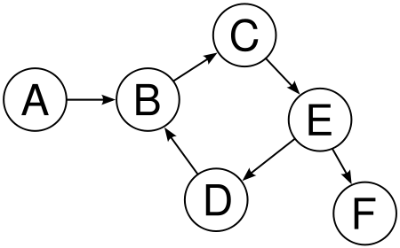
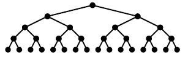
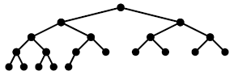
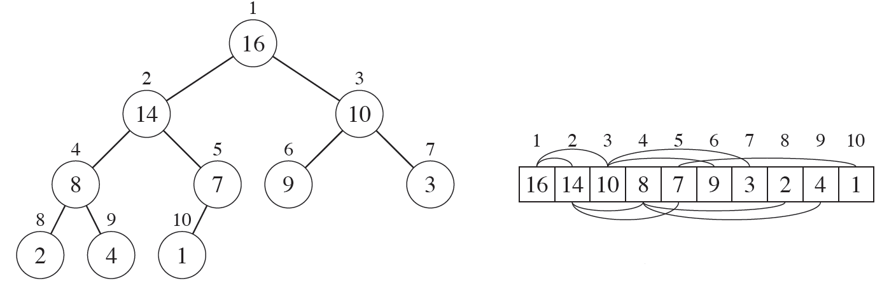
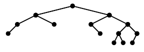
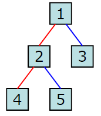
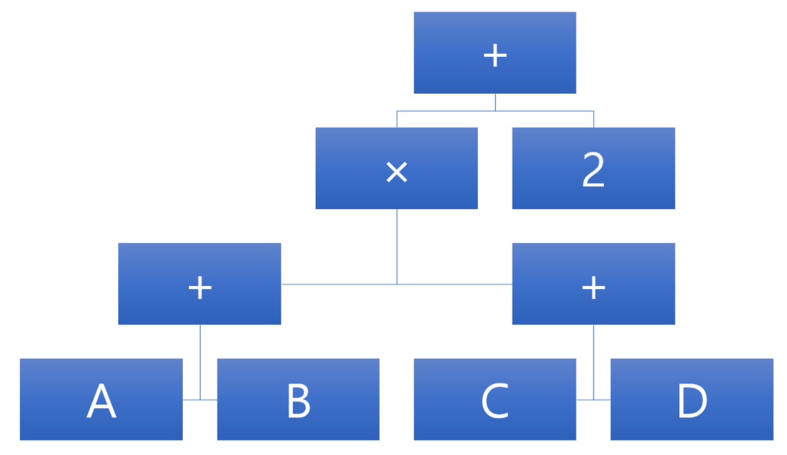

# 이진트리(binary tree)
## 트리
1. 정의

    + 노드(node)와 노드 사이를 이루어진 선(엣지, Edge)로 이루어진 자료 구조다.


    + 엣지로 연결된 노드들로 이루어진 시퀀스는 경로(path)라고 한다. 이때 경로에 속한 엣지의 수를 경로의 길이 라고 한다.

    + 트리의 높이는 루트노드에서 말단노드에 이르는 가장 긴 경로의 길이를 가르킨다. 이때 트리에서 특정한 깊이에 존재하는 노드의 집합을 레벨(Level)이라 한다.

    + 이때 자식이 없는 노드 즉 하위 레벨이 없는 노드를 잎새 노드(Leaf node)라고 한다. 반대로 상위 레벨이 없는 노드는 루트 노드(Rood node)라고한다. Leaf node를 제외한 모든 노드는 internal nodes라고 표현한다.

2. 속성
    + 트리의 속성 중 가장 중요한 것은 '루트 노드를 제외한 모든 노드는 단 하나의 부모노드만을 가진다'이다. 즉 1대1이여야만 한다.
        + 임의의 노드에서 다른 노드로가는 경로는 유일하다
        + 모든 노드는 서로 연결되어 있다
        + 회로(cycle)이 존재하지 않는다.
            
        + 엣지(edge)를 하나 자르면 트리는 2개로 분리된다.

----

## 이진트리(Binary tree)
+ 정의
    + 이진트리란 지식노드가 최대 두 개인 노드들로 구성된 트리다. 종류로는 정이진트리(FullBinarryTree), 완전이진트리(CompleteBinaryTree), 균형이진트리(BalancedBinaryTree)등이 있다.

+ 정이진트리(FullBinaryTree)
     + 
            그림과 같이 모든 레벨에서 노드들이 꽉 채워진 이진트리이다.

     + 정이진트리에서 레벨에 따른 노드의 숫자는 2배씩 증가한다  

     |레벨|노드수|
     |--|--|
     |0|2^0|
     |1|2^1|
     |2|2^2|
     |...|...|
     |k|2^k|
     |total|2^(k+1)-1|

     + 정이진트리의 노드수가 n개라면 잎새노드 수는 n/2를 올림한 숫자가 된다


+ 완전이진트리(CompleteBinaryTree)
    + 
        완전이진트리는 사진과 같이 마지막 레벨을 제외한 모든 레벨에서 노드들이 꽉 채워진 이진 트리이다.

    + 
        정이진트리와 완전이진트리는 다음처럼 1차원 배열로 표현이 가능하다

    + 어떤 노드의 인덱스를 index, 왼쪽 자식노드의 인덱스를 left_index, 오른쪽 자식노드의 인덱스를 right_index로 선언하면 다음과 같은 관계를 지닌다.

    ``` ptyhon
    left_index = 2 * index + 1
    right_index = 2 * index + 2
    ```

+ 균형이진트리
    
    + 모든 잎새노드의 깊이 차이가 1이하인 트리를 의미한다. 균형 이진트리는 예측 가능한 깊이를 가지며 노드가 n개인 균형이진트리의 깊이는 logn을 내림한 값이 된다.


## 트리순회(tree traversal)
+ 트리의 각노드를 하나도 빠뜨리지 않고 중복없이 방분하는 체계적인 방법

    + 전위순회(preorder)
        루트노드 - 왼쪽 서브트리 - 오른쪽 서브트리 순으로 순회하는 방식. 깊이우선순회라고도 한다.
        ```
        1,2,4,5,3
        ```
    
    + 중위순회(inorder)
        왼쪽 서브트리 - 루트노드 - 오른쪽 서브트리 순으로 순회. 대칭순회라고도 한다.
        ```
        4,2,5,1,3
        ```

    + 후위순회(postorder)
        왼쪽 서브트리 - 오른쪽서브트리 - 노드 순으로 순회하는 방식
        ```
        4,5,2,3,1
        ```


+ 예시 : 사칙연산
### (A+B)X(C+D)+2
 

  위와 같은 식을 계산해야된다. 이를 후위표기법으로 바꾸면
### AB+CD+X2+
 위와같이 표현된다.
 
 전위순회 방식으로 읽는다면
 ### +X+AB+CD2
 위와 같이 표현된다.

 이는 함수명(인자) 형태의 함수호출과 동일하다
 ### add(multiply(add(A, B), add(C, D)), 2)
    


