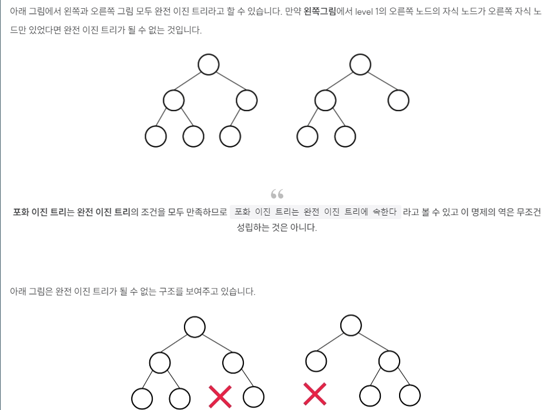
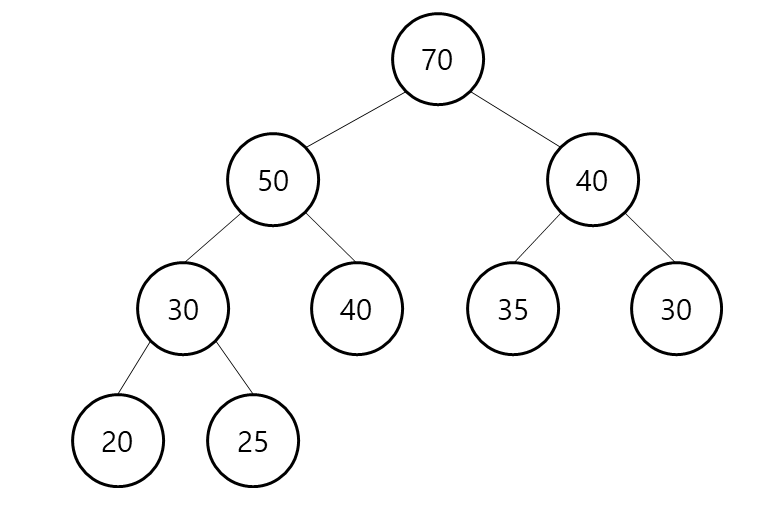
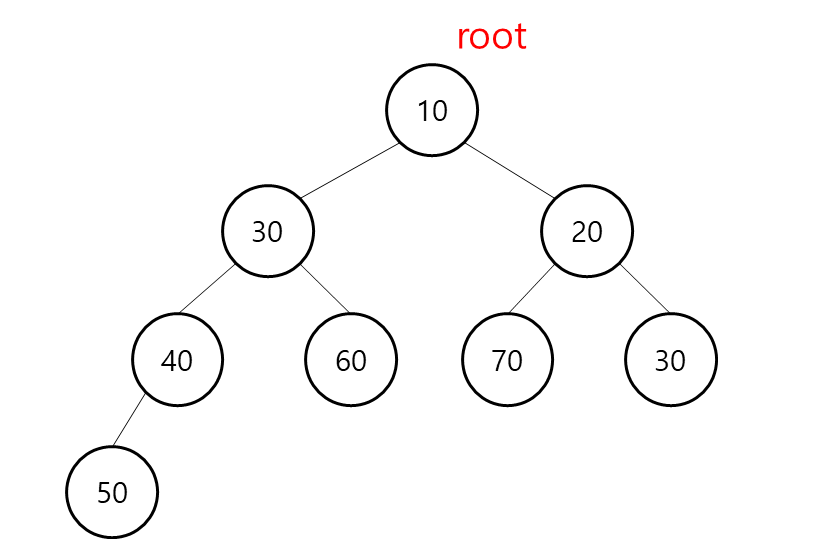
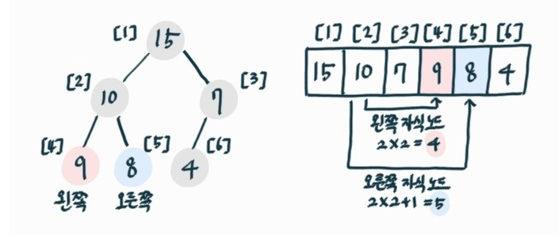
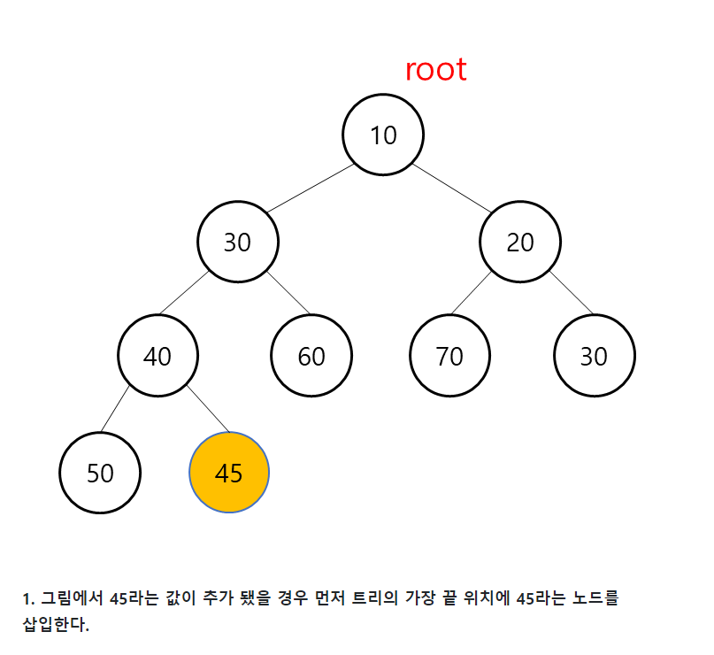
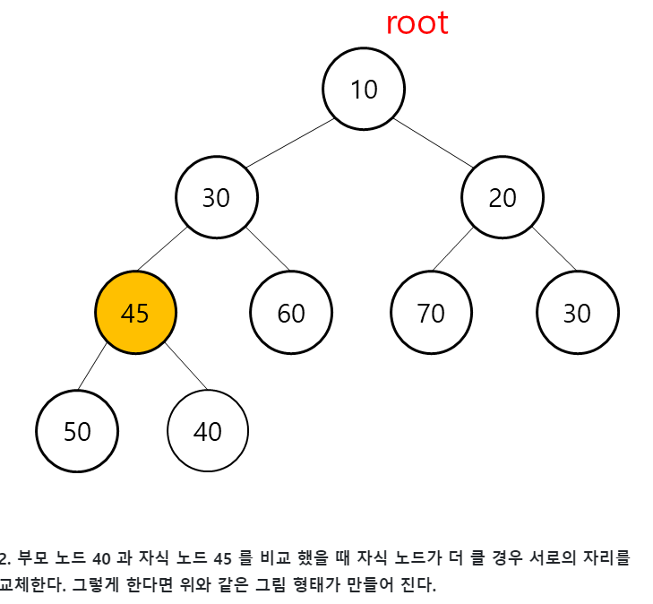
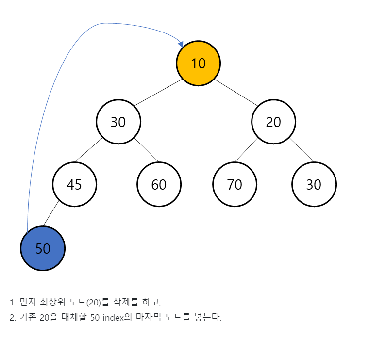
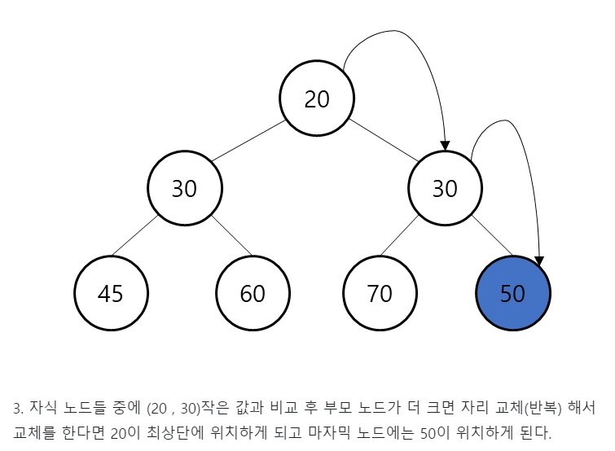

# Heap

## 1. 힙의 정의
- **완전 이진 트리(Complete Binary Tree)**이다. - 힙의 양쪽 자식 트리 역시 힙이다.
- **부모 노드의 키값과 자식 노드의 키값 사이에는 대소관계가 성립**한다.
    - 키값 대소관계는 부모-자식 간에만 성립되며, 형제 사이에는 대소관계가 정해지지 않는다.(반 정렬)
- 반정렬 상태힙 트리는 **중복된 값을 허용**한다. (이진 탐색 트리는 중복값 허용 X)
- 최댓값이나 최소값을 빠르게 찾는데 용이하다.

- **이진 트리**(Binary Tree)
    - 인 트리 구조 : 각 노드의 차수(자식 노드)가 2이하
    - **이진 탐색 트리**(Binary Search Tree, BST)
        - **굉장히 중요한 트리 구조**로 BST라고도 함
            
            순서화된 이진 트리
            
        - 노드의 왼쪽 자식은 부모의 값보다 항상 작은 값을 가져야 하고 노드의 오른쪽 자식은 부모의 값보다 항상 큰 값을 가져야 한다는 규칙이 존재
- 완전이진트리
    
    다음 두 조건을 만족할 대 완전 이진 트리라고 합니다.
    
    - 마지막 레벨을 제외하고 모든 노드가 채워진 트리 구조입니다.
    - 노드는 왼쪽에서 오른쪽으로 채워져야 합니다.
        
       
        

## 2. 힙의 종류
    - 최대 힙 max heap
        - 부모 노드 값이 자식 노드의 값보다 크거나 같다.
        - 루트의 값은 저장된 원소들중에 가장 크다.
    
    
    
    - 최소 힙 min heap
        - 부모 노드 값이 자식 노드의 값보다 작거나 같다.
        - 루트의 값은 저장된 원소들중에 가장 작다.
        
       
         


      
        
## 3. 힙의 구현(개념적)
    
    배열로 구현한다. 계산 편의를 위해 인덱스 0을 사용하지 않고 바로 1을 쓰기도 한다.
    
    부모-자식간 인덱스 관계 :
    
    인덱스 i에서의 부모 인덱스 : i/2
    
    왼쪽 : i * 2
    
    오른쪽 : (i*2) + 1
        
       
    


   
    
## 4. 힙의 연산
- 삽입 연산1) 마지막 위치에 노드 만들어 삽입 `> 구조적 성질 만족`2-1) 부모 노드보다 값이 작으면 끝2-2) 부모 노드보다 값이 크면 부모노드와 스위치3) 2번 과정 최대 루트까지 반복 `> 힙의 성질 만족시키기`
    
    
    
- 삭제연산1) 루트 노드 값 제거2) 마지막 노드 값 루트로 옮기고 노드 삭제 `> 구조적 성질 만족`3-1) 자식 노드보다 값 크면 끝3-2) 자식 노드보다 값 작으면 스위치4) 3번 과정 최대 리프까지 반복 `> 힙의 성질 만족시키기`


## 5. 힙 연산의 시간복잡도
- 삽입연산
    - 최악의 경우 교환을 반복하여 리프노드에서 루트노드가 될 수 있음
    - 교환은 O(1)시간에 처리
- 삭제연산
    - 최악의 경우 교환을 반복하여 루트노드에서 리프노드가 될 수 있음
    - 교환은 O(1)시간에 처리

> 두 연산 모두 최악의 경우 교환 횟수는 힙의 높이(height)가 된다. 힙은 완전 이진 트리이므로 높이가 log_2 n을 넘지 않는다. 따라서 두 연산의 시간복잡도는 O(log n)이다.
> 

| 연산 | 시간복잡도 |
| --- | --- |
| 삽입 | O(log n) |
| 삭제 | O(log n) |


## 6. 힙의 응용
- 우선순위 큐 : 일반적 선입선출과 달리 우선순위가 높은 데이터가 먼저 나오는 우선순위 큐를 힙을 통해 구현할 수 있다.

→ 기능 : PriorityQueue

```jsx
new PriorityQueue<[type]>()
Min heap으로 동작
Max heap은 Collections 필요
//오름차순
PriorityQueue<Integer> pq = new PriorityQueue<>();
  
  //내림차순
PriorityQueue<Integer> pqHightest = new PriorityQueue<>(Collections.reverseOrder());
```

- 상세
    
    ## 삽입
    
    > addoffer
    > 
    - `add(E element)`
        - 큐 공간 없어 삽입 실패 시 exception터짐
    - `offer(E element)`
        - 큐 공간 없어 삽입 실패 시 null 반환
    
    ```java
    	pq.add(3);
    	pq.add(1);
    	pq.offer(2); //pq: [1, 3, 2]
    ```
    
    ---
    
    ## 삭제
    
    > pollremoveremoveIfremoveAllclear
    > 
    - `poll()`
        - front에 위치한 원소 제거 후 반환
        - 큐 비었다면 null 반환
    - `remove()`
        - front에 위치한 원소 제거 후 반환
        - 큐 비었다면 exception 터짐
    
    ```java
    	pq.poll();
    	pq.remove();
    ```
    
    - `removeIf(Predicate<? super E> filter)`
        - 람다 표현식으로 파라미터 전달 가능
        - 필터링 조건
    
    ```java
    	//pq: [1, 2, 3, 4, 5]
    	pq.removeIf(n -> (n % 2 == 0)); //pq: [1, 3, 5]
    ```
    
    - `remove(E element)`*반환형: boolean*
        - 특정 원소 제거
        - 삭제하려는 원소 큐에 없으면 false 반환
    - `removeAll(Collection<?>)`
        - 파라미터로 준 컬렉션의 겹치는 원소들 제거
    
    ```java
    	//pq1: [1, 2, 3, 4, 5]
        //pq2: [1, 3, 5]
        pq1.removeAll(pq2); //p1: [2, 4]
        pq1.remove(9); //false
    ```
    
    ---
    
    ## 접근
    
    > peekiterator
    > 
    - `peek()`*반환형: E, queue의 형식*
        - 첫 번째 데이터 반환
        - 큐 비어있다면 null 반환
    
    ```java
    	int i = pq.peek();
    ```
    
    - `iterator()`*반환형: Iterator*
        - 데이터 지우지 않고 순회할 경우 사용
    
    ```java
    	//pq: [1, 3, 2]
    	Iterator<Integer> iter = pq.iterator();
    	while(iter.hasNext()) {
    		Integer i = iter.next();
    		System.out.print(i + " ");
    	}
    ```
    
    ```
    	출력
        1 3 2
    ```
    
    ---
    
    ## 기타
    
    > sizetoArraycontains
    > 
    - `size()`*반환형: int*
    
    ```java
    	int size = pq.size()
    ```
    
    - `toArray()`*반환형: Object[]*
        - 큐에 저장된 데이터 배열로 가져옴
    
    ```java
    	for(Object i : pq.toArray()) {
    		System.out.println(i);
    	}
    ```
    
    ```
    	출력
        1 3 2
    ```
    
    ---
    
    ## 우선순위 지정
    
    > 특정 기준으로 정렬하고 싶거나 큐에 저장된 객체의 어떤 속성으로 정렬하고 싶을 때 다음을 이용한다.
    > 
    > 
    > 1. implements Comparable
    > 
    > 2. Comparator 생성
    > 
    
    ```java
    	예제 클래스
        public class People {
    		String name;
    		int age;
    		int height;
    	}
    
    ```
    
    - Comparable
        - 클래스에 Comparable 상속받음
        - compareTo 오버라이딩
    
    ```java
        public class People implements Comparable<People>{
    	String name;
    	int age;
    	int height;
    
    	@Override
    	public int compareTo(People o) {
        // 키로 오름차순 정렬
        // 현재 객체가 o보다 작으면 -1, 크면 1 반환
        // 동일하면 0 반환
    		return (this.height > o.height ? 1 : -1);
            }
        }
    
    ```
    
    - Comparator
        - 선언할 때 우선순위 지정해줌
        - compare 함수를 오버라이딩
    
    ```java
    	PriorityQueue<People> pq = new PriorityQueue<>(new Comparator<People>() {
        	@Override
    		public int compare(People o1, People o2) {
        		return o1.height > o2.height ? 1 : -1;
            	}
        	});
    ```
    

- 힙을 이용한 정렬
    - 1) 정렬할 데이터 n개 하나씩 힙에 삽입 -> `O(n) * O(logn)`
        
        2) 최댓값 차례로 하나씩 삭제하여 보관 -> `O(n)`
        
    - 시간복잡도: O(nlogn) + O(n) = O(nlogn)
    


    
# 7. 자바 코드로 구현

7-1) ArrayList로 구현 최소 힙 - 삽입 / 삭제

이때 0번째 인덱스는 사용 안함

- 이유
    
    자바에서의 배열과 같은 데이터 구조는 0부터 시작합니다. 이는 배열의 인덱스가 해당 요소와 관련된 메모리 위치를 참조하기 위한 오프셋으로 사용되기 때문입니다.
    
    그러나 Heap(힙)을 다룰 때 0번째 인덱스가 사용되지 않는 이유는 힙을 이진 트리(binary tree)로 구현하는 경우가 많기 때문입니다. 이진 트리에서는 0번째 인덱스를 사용하지 않고, 1번째 인덱스부터 데이터를 저장하는 것이 편리합니다.
    
    이렇게 하면 부모 노드의 인덱스를 **`i`**로 두었을 때, 왼쪽 자식 노드의 인덱스는 **`2*i`**, 오른쪽 자식 노드의 인덱스는 **`2*i + 1`**로 계산할 수 있습니다. 따라서 0번째 인덱스를 사용하지 않고 1번째 인덱스부터 데이터를 저장함으로써 이진 트리의 구조를 쉽게 관리할 수 있습니다.
    

```jsx
class MinHeap{
    ArrayList<Integer> heap;

    public MinHeap(){
        this.heap = new ArrayList<>();
        this.heap.add(0); // index로 찾기 위한 0의 dummy 데이터 삽입
    }
}

public void insert(int data) {
	//1 . 마지막 위치에 데이터 삽입
	heap.add(data);

	// 우리는 비교할 자식 노드의 Index를 가지고 부모 노드 cur / 2 의 Index의 데이터 끼리 비교할 것이다.
	int cur = heap.size() - 1; // 마지막 위치의 데이터

	// 이제 여기서 계속해서 자식 노드와 부모 노드가 큰 값이 있는지를 찾고 있다면은 값을 바꿔준다.
    // 최소 비교 대상을 준수 및 부모 노드의 데이터를 최근에 가져온 데이터와 비교
    while (cur > 1 && heap.get(cur / 2) > heap.get(cur)) {
    	int parentVal = heap.get(cur/2);
    	heap.set(cur / 2, data);
        heap.set(cur, parentVal);

		cur /= 2;
	}

}


public Integer delete() {
        if (heap.size() == 1) {
            System.out.println("Heap is empty");
            return null;
        }
        // 상위 데이터
        int target = heap.get(1);
		
		// 1 , 2에 해당하는 과정을 수행하고,
        heap.set(1, heap.get(heap.size() - 1));
        heap.remove(heap.size() - 1);

        int cur = 1; // 최상위 노드 index
        while (true) {
			// 외쪽 자식 노드
            int leftIdx = cur * 2;

			// 오른쪽 자식 노드
			int rightIdx = cur * 2 + 1;
            int targetIdx = -1;

            if (rightIdx < heap.size()) { // 오른쪽 자식 노드가 있는지 체크
                //
                targetIdx = heap.get(leftIdx) < heap.get(rightIdx) ? leftIdx : rightIdx;
            } else if (leftIdx < heap.size()) {
                // 자식 노드가 하나인 경우
                targetIdx = leftIdx;
            } else {
                break;
            }

            if (heap.get(cur) < heap.get(targetIdx)) {
                break;
            } else {
                int parentval = heap.get(cur);
                heap.set(cur, heap.get(targetIdx));
                heap.set(targetIdx,parentval);
                cur = targetIdx;
            }
        }
        return target;
    }
```






자바에는 기본적으로 힙 메서드가 없다.

하지만 PriorityQueue 클래스를 사용 할 수 있다. (6번 상세 참조)

힙 자체가 일종의 큐이기 때문에 우선순위 큐로 대체가 가능한것.

```jsx
import java.util.PriorityQueue;

public class MinHeap {
    private PriorityQueue<Integer> minHeap;

    public MinHeap() {
        minHeap = new PriorityQueue<>();
    }

    public void insert(int value) {
        minHeap.offer(value);
    }

    public int extractMin() {
        if (isEmpty())
            throw new IllegalStateException("Heap is empty");
        return minHeap.poll();
    }

    public boolean isEmpty() {
        return minHeap.isEmpty();
    }

    public static void main(String[] args) {
        MinHeap minHeap = new MinHeap();
        minHeap.insert(3);
        minHeap.insert(2);
        minHeap.insert(1);

        System.out.println("Extracted min value: " + minHeap.extractMin());
        System.out.println("Extracted min value: " + minHeap.extractMin());
        System.out.println("Extracted min value: " + minHeap.extractMin());
    }
}
```


# 8. 힙에 관련한 CS질문
- 힙은 완전이진트리를 통해서 구현되었기 때문에 우선순위 큐의 시간복잡도는 O(logn)
- Priority Queue의 동작 원리가 어떻게 되나요?

우선순위 큐는 가장 우선순위가 높은 데이터를 먼저 꺼내기 위해 고안된 자료구조입니다. 우선순위 큐를 구현하기 위해 일반적으로 힙을 사용합니다. 힙은 완전 이진 트리를 통해 구현되었기 때문에 우선순위 큐의 시간복잡도는 O(log n) 입니다.

우선순위 큐는 힙이라는 자료를 가지고 구현합니다. top이 최대면 최대 힙, 최소면 최소힙으로 표현합니다. 힙으로 구현된 이진 트리는 모든 정점이 자신의 자식 요소보다 우선순위가 높다는 성질을 가지고 있습니다. 이 성질을 통해 삽입과 삭제 연산을 모두 O(log n)으로 수행할 수 있습니다.

- 자바 메모리 구조 힙과 무슨 관련?

자바의 메모리 구조에서 나오는 "힙(Heap)" 영역과 "힙(Heap)"은 다른 의미를 갖습니다.

1. **자바의 메모리 구조에서의 "힙(Heap)" 영역:** 자바의 메모리 구조에서 "힙(Heap)"은 프로그램이 동적으로 할당한 객체들이 저장되는 영역을 가리킵니다. 자바에서 객체는 힙 메모리에 저장되며, 각 객체는 런타임에 동적으로 할당되고 해제됩니다. 이 힙 영역은 가비지 컬렉션(Garbage Collection)에 의해 관리되며, 더 이상 사용되지 않는 객체는 자동으로 메모리에서 해제됩니다.
2.  **"힙(Heap)":** 여기서 이야기하는 "힙(Heap)"은 데이터 구조의 한 종류로서, 이진 힙(Binary Heap)을 가리킵니다. 이진 힙은 완전 이진 트리의 형태를 띠며, 부모 노드와 자식 노드 간의 순서를 유지하는 자료 구조입니다. 힙은 일반적으로 우선순위 큐(Priority Queue)를 구현하는 데에 사용되며, 배열을 기반으로 하여 구현될 수 있습니다.

따라서 이 두 가지 "힙"은 이름은 같지만 서로 다른 의미를 갖습니다. 자바의 메모리 구조에서의 "힙"은 메모리 관리의 영역을 가리키고, 이진 힙은 데이터 구조의 한 종류로서 우선순위 큐 등에 사용됩니다.

- 메모리 관리 힙
    
    힙 영역: 프로그래머가 직접 관리할 수 있는 메모리 영역으로 이 공간에 메모리를 할당하는 것을 동적 할당이라고 부릅니다. Java에서는 가비지 컬렉터가 자동으로 해제해줍니다. 힙 영역은 스택 영역과 달리 낮은 주소에서 높은 주소로 메모리가 할당됩니다.
    

- Heapify
    
    자바에서 "Heapify"란 주어진 배열을 힙 트리(Heap Tree)의 성질을 만족하도록 재구성하는 과정을 말합니다. 주로 힙 정렬(Heap Sort) 알고리즘에서 사용되며, 주어진 배열을 최대 힙(Max Heap) 또는 최소 힙(Min Heap)으로 만들어줍니다.
    
    일반적으로 Heapify 과정은 다음과 같이 진행됩니다:
    
    1. 주어진 배열을 힙 트리의 형태로 구성합니다. 이때 배열의 각 요소는 힙의 각 노드에 대응됩니다.
    2. 주어진 노드와 그 자식 노드들 간의 관계를 확인하고 필요한 경우 노드들을 재배치합니다. 최대 힙의 경우에는 부모 노드가 자식 노드보다 항상 크거나 같도록, 최소 힙의 경우에는 부모 노드가 자식 노드보다 항상 작거나 같도록 재배치합니다.
    3. 재배치된 노드와 그 자식 노드들 간의 관계를 확인하고 필요한 경우 재귀적으로 Heapify 과정을 반복합니다. 이렇게 함으로써 전체 힙 트리가 최대 힙 또는 최소 힙의 성질을 만족하게 됩니다.
    
    Heapify 과정은 주로 힙 정렬 알고리즘에서 사용되지만, 우선순위 큐 등에서도 사용될 수 있습니다. 힙 정렬 알고리즘에서는 초기 배열을 힙으로 만든 후, 가장 큰(또는 작은) 요소를 반복적으로 추출하여 정렬된 배열을 얻는 과정을 거치는데, 이 때 Heapify를 사용하여 배열을 힙으로 만들게 됩니다.
    
    - heapify 코드
        
        기본
        
        ```jsx
        void max_heapify (int arr[], int i)
        {
          int largest = i;  
          int l_child = 2 * i;			// 왼쪽 자식 노드 인덱스
          int r_child = 2 * i + 1;		// 오른쪽 자식 노드 인덱스
          int size = arr.length;
          
          // i번째 요소와 그 자식 노드들의 값 비교
          if(l_child <= size && arr[l_child] > arr[i])		// 왼쪽
            largest = l_child;
          if(r_child <= size && arr[r_child] > arr[largest])	// 오른쪽
            largest = r_child;
          
          // i번째 요소보다 큰 자식 노드가 존재한다면
          if(largest != i) {
            int tmp = arr[i];			// 자식 노드와 현재 노드 값 교환
            arr[i] = arr[largest];
            arr[largest] = tmp;
            
            max_heapify (arr, largest);		// 교환된 자식노드부터 다시 heapify
          } 
        }
        ```
        
        상세
        
        ```jsx
        public class HeapifyExample {
            public static void main(String[] args) {
                int[] arr = {4, 10, 3, 5, 1};
                
                System.out.println("Original array:");
                printArray(arr);
                
                // 주어진 배열을 Heapify
                heapify(arr);
                
                System.out.println("Array after Heapify:");
                printArray(arr);
            }
            
            // 주어진 배열을 Heapify하는 메서드
            public static void heapify(int[] arr) {
                int n = arr.length;
                
                // 마지막 노드의 부모 노드부터 시작하여 root까지 Heapify 수행
                for (int i = n / 2 - 1; i >= 0; i--) {
                    heapifyUtil(arr, n, i);
                }
            }
            
            // 배열에서 특정 노드를 root로 하는 서브트리를 Heapify하는 보조 메서드
            public static void heapifyUtil(int[] arr, int n, int i) {
                int largest = i; // 루트 노드를 가장 큰 값으로 초기화
                int left = 2 * i + 1; // 왼쪽 자식 노드의 인덱스
                int right = 2 * i + 2; // 오른쪽 자식 노드의 인덱스
                
                // 왼쪽 자식 노드가 부모 노드보다 크다면
                if (left < n && arr[left] > arr[largest]) {
                    largest = left;
                }
                
                // 오른쪽 자식 노드가 부모 노드보다 크다면
                if (right < n && arr[right] > arr[largest]) {
                    largest = right;
                }
                
                // 부모 노드와 자식 노드를 교환하여 Heapify 수행
                if (largest != i) {
                    int temp = arr[i];
                    arr[i] = arr[largest];
                    arr[largest] = temp;
                    
                    // 변경된 자식 노드를 root로 하는 서브트리에 대해 Heapify 재귀적으로 수행
                    heapifyUtil(arr, n, largest);
                }
            }
            
            // 배열을 출력하는 메서드
            public static void printArray(int[] arr) {
                for (int num : arr) {
                    System.out.print(num + " ");
                }
                System.out.println();
            }
        }
        ```
        
    
- 힙 정렬(Heap Sort)에 대해 설명해주세요.

힙 정렬은 주어진 데이터를 힙 자료구조로 만들어 최댓값 또는 최솟값부터 하나씩 꺼내서 정렬하는 알고리즘 입니다. 시간 복잡도는 O(nlogn)입니다.)https://www.notion.so/Heap-6854753a4b864bb19c6287d2ecfbae15

