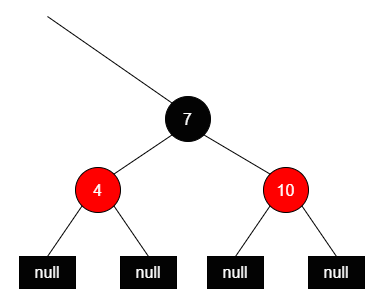
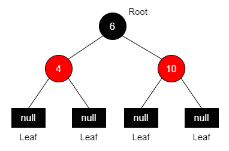
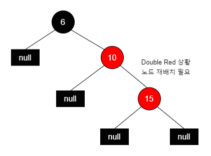
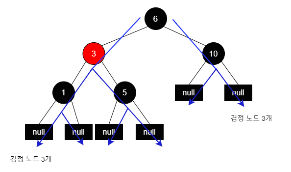

# 레드-블랙 트리 (Red-Black Tree)

레드-블랙 트리에 대해 알아보겠다. 

레드-블랙 트리(Red-Black Tree)는 이진 탐색 트리(Binary Search Tree)의 일종으로서, 각 노드가 레드 또는 블랙으로 색칠되어 있는 트리를 가리킨다.

 

## 레드-블랙 트리의 규칙

1. <b>각 노드는 레드 또는 블랙 중 하나의 색상을 가진다.</b>
2. <b>루트 노드(Root Node)와 리프 노드(Leaf Node)는 블랙이다.</b> (이때 리프 노드는 null을 가리키는 포인터이다.)
3. <b>레드 노드의 자식 노드는 모두 블랙이다.</b>
4. <b>어떤 노드에서 리프 노드에 이르는 모든 경로에는 동일한 개수의 블랙 노드가 있다.</b> 이를 트리의 <b>블랙 높이(Black Height)</b>라고 한다.

 

레드-블랙 트리는 이러한 속성들을 유지하면서 삽입, 삭제, 탐색 등의 연산을 수행할 때 트리의 균형을 유지하는 <b>자가 균형 트리(self-balancing tree)</b>이다.

이러한 특성으로 인해 레드-블랙 트리는 <u>항상 O(log n)의 시간 복잡도를 보장</u>한다. 삽입, 삭제 연산이 빈번한 경우 레드-블랙 트리를 활용하는 것이 효과적이다.

  

위 규칙들에 대해 좀 더 구체적으로 알아보겠다.

### 규칙 1. 각 노드는 레드 또는 블랙 중 하나의 색상을 가진다.

말 그대로 각 노드는 빨간색 혹은 검정색 중 하나를 가져야 한다는 것이다. 다음 그림을 보자.

<!--  -->

 

모든 노드는 검정 혹은 빨강의 색을 가지게 된다. 이 색상 정보를 저장하기 위해 각 노드는 추가적으로 1 bit 씩 저장공간을 가지게 된다. (overhead) 레드 블랙 트리의 경우 일반적으로 0은 검정, 1은 빨강을 의미한다.

각 노드는 key-value 정보, left and right children nodes, parent node를 가리키는 포인터(pointer) 등의 핵심적인 정보를 저장하는 공간을 차지하게 된다. 이러한 저장공간들에 비해 색상 정보를 담는 1 비트의 공간은 매우 미미한 편이고, 이 추가적인 공간을 통해 효율적으로 트리의 균형을 찾을 수 있다.

 

### 규칙 2. 루트 노드와 리프 노드는 블랙이다.

레드-블랙 트리의 루트 노드와 리프 노드는 검정색이다.

 

위 그림을 보면, 맨 위에 있는 루트 노드(Root Node)와, 맨 아래에 있는 리프 노드(Leaf Node)의 색상이 검정색이다.

레드-블랙 트리에서 <u>삽입, 삭제 연산으로 인해 노드의 재배치가 실행될 때 일시적으로 루트 노드가 빨간색이 될 수 있다.</u> 하지만 <u>최종적으로는 항상 검정 노드여야 한다.</u>

이때 리프 노드는 null이다. 이진 탐색 트리의 일종이기 때문에, 각 노드는 두 개의 자식을 가리키게 된다. 그런데 자식이 없을 경우, 왼쪽 오른쪽에 '비어있다'는 의미의 null을 가리키고 있는 것이다.

레드-블랙 트리에서는 이 마지막 두 개의 null 노드를 리프 노드로 칭한다.

그리고 이러한 리프 노드는 "<b>NIL Node</b>"라고 부르기도 한다. "NIL"은 "Nihil"의 약어로, "nothing", "zero"를 의미하는 라틴어이다. 컴퓨터 자료구조에서 "NIL"은 노드가 null인 것을 지칭하는 데 사용된다.

 

### 규칙 3. 레드 노드의 자식 노드는 모두 블랙이다.

빨간색 노드의 자식 노드로 검정색 노드만 배치될 수 있다. 만약 빨간색 노드의 자식 노드로 빨간색 노드가 오면 Double Red라고 부른다.

Double Red 상황이 되면 규칙 3을 어긴 것이기에, 노드 재배치가 실행된다.

  

### 규칙 4. 어떤 노드에서 리프 노드에 이르는 모든 경로에는 동일한 개수의 블랙 노드가 있다.

특정 노드를 기준으로 해서, 리프 노드로 가는 모든 경로를 봤을 때 항상 같은 수의 검정 노드가 있어야 한다. 다음 그림을 보자.

 

위 그림에서 루트 노드 6을 포함해 리프 노드로 가는 모든 경로를 봤을 때, 검정 노드의 수는 항상 3이다.

또, 레드 노드 3을 기준으로 리프 노드로 가는 모든 경로를 보면, 검정 노드의 수는 항상 2이다.

이를 레드-블랙 트리의 <b>'블랙 높이(Black Height)'</b>라고 한다.
