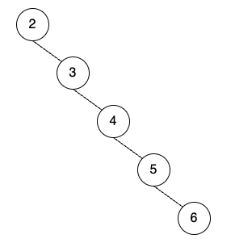
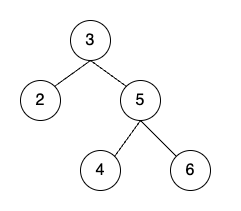

# 레드-블랙 트리 (Red-Black Tree)

레드-블랙 트리에 대해 알아보겠다. 

레드-블랙 트리(Red-Black Tree)는 이진 탐색 트리(Binary Search Tree)의 일종으로서, 각 노드가 레드 또는 블랙으로 색칠되어 있는 트리를 가리킨다.

 

## AVL 트리와 비교

레드-블랙 트리를 이해하기 위해서는 이진 탐색 트리와 AVL 트리를 어느 정도 이해하는 것이 유리하다. 

AVL(Adelson-Velsky and Landis) 트리는 스스로 균형 잡는 이진 탐색 트리로, 삽입과 삭제 연산 시 트리의 균형도를 계산하여 불균형을 완화하는 트리이다.

 

'균형을 잡는다'는 것은 무슨 뜻일까?

이진 탐색 트리의 경우, 삽입 순서에 따라 트리의 쏠림 현상이 발생할 수 있다. 예를 들어 2, 3, 4, 5, 6의 순서로 삽입하면 다음과 같이 트리가 형성되는 것이다.

상당히 불균형한 트리가 형성된 것을 볼 수 있다.

 

하지만 AVL 트리의 경우 같은 순서로 삽입했을 때 다음과 같이 트리가 형성되고, 높이가 2인 트리가 되어 최대 탐색 횟수가 2이면 끝이 난다.

위의 이진 탐색 트리와 비교했을 때 매우 균형 잡힌 '균형 트리'가 되었다.

 

AVL 트리와 레드-블랙 트리의 차이점은 다음과 같다.

1. 레드-블랙 트리는 AVL 트리보다는 균형을 엄격하게 맞추지 않고, 노드 재배치를 자주 실행하지 않기에 삽입 및 삭제 연산이 많다면 AVL 트리보다 평균적으로 더 나은 성능을 가지고 있다.
2. 레드-블랙 트리는 AVL 트리보다 덜 균형하다. 그래서 평균 탐색 횟수는 AVL 트리보다 더 많을 수 있다.

즉, 삽입・삭제 연산이 빈번하다면 Red-Black Tree를 이용하는 것이 낫고, 삽입・삭제 연산이 빈번하지 않고 탐색의 성능이 더 중요하다면 AVL 트리를 이용하는 것이 더 나은 것이다.

 

## 레드-블랙 트리의 규칙

1. <b>각 노드는 레드 또는 블랙 중 하나의 색상을 가진다.</b>
2. <b>루트 노드(Root Node)와 리프 노드(Leaf Node)는 블랙이다.</b> (이때 리프 노드는 null을 가리키는 포인터이다.)
3. <b>레드 노드의 자식 노드는 모두 블랙이다.</b>
4. <b>어떤 노드에서 리프 노드에 이르는 모든 경로에는 동일한 개수의 블랙 노드가 있다.</b> 이를 트리의 <b>블랙 높이(Black Height)</b>라고 한다.

 

레드-블랙 트리는 이러한 속성들을 유지하면서 삽입, 삭제, 탐색 등의 연산을 수행할 때 트리의 균형을 유지하는 <b>자가 균형 트리(self-balancing tree)</b>이다.

이러한 특성으로 인해 레드-블랙 트리는 <u>항상 O(log n)의 시간 복잡도를 보장</u>한다. 삽입, 삭제 연산이 빈번한 경우 레드-블랙 트리를 활용하는 것이 효과적이다.

  

위 규칙들에 대해 좀 더 구체적으로 알아보겠다.

### 규칙 1. 각 노드는 레드 또는 블랙 중 하나의 색상을 가진다.

말 그대로 각 노드는 빨간색 혹은 검정색 중 하나를 가져야 한다는 것이다. 다음 그림을 보자.

<!--  -->

 

모든 노드는 검정 혹은 빨강의 색을 가지게 된다. 이 색상 정보를 저장하기 위해 각 노드는 추가적으로 1 bit 씩 저장공간을 가지게 된다. (overhead) 레드 블랙 트리의 경우 일반적으로 0은 검정, 1은 빨강을 의미한다.

각 노드는 key-value 정보, left and right children nodes, parent node를 가리키는 포인터(pointer) 등의 핵심적인 정보를 저장하는 공간을 차지하게 된다. 이러한 저장공간들에 비해 색상 정보를 담는 1 비트의 공간은 매우 미미한 편이고, 이 추가적인 공간을 통해 효율적으로 트리의 균형을 찾을 수 있다.

 

### 규칙 2. 루트 노드와 리프 노드는 블랙이다.

레드-블랙 트리의 루트 노드와 리프 노드는 검정색이다.

 

위 그림을 보면, 맨 위에 있는 루트 노드(Root Node)와, 맨 아래에 있는 리프 노드(Leaf Node)의 색상이 검정색이다. 레드-블랙 트리는 다른 트리들과 다르게 물리적으로 null 노드가 존재한다. 항상 리프 노드는 null node이며, 검정색이다.

레드-블랙 트리에서 <u>삽입, 삭제 연산으로 인해 노드의 재배치가 실행될 때 일시적으로 루트 노드가 빨간색이 될 수 있다.</u> 하지만 <u>최종적으로는 항상 검정 노드여야 한다.</u>

이때 리프 노드는 null이다. 이진 탐색 트리의 일종이기 때문에, 각 노드는 두 개의 자식을 가리키게 된다. 그런데 자식이 없을 경우, 왼쪽 오른쪽에 '비어있다'는 의미의 null을 가리키고 있는 것이다.

레드-블랙 트리에서는 이 마지막 두 개의 null 노드를 리프 노드로 칭한다.

그리고 이러한 리프 노드는 "<b>NIL Node</b>"라고 부르기도 한다. "NIL"은 "Nihil"의 약어로, "nothing", "zero"를 의미하는 라틴어이다. 컴퓨터 자료구조에서 "NIL"은 노드가 null인 것을 지칭하는 데 사용된다.

 

### 규칙 3. 레드 노드의 자식 노드는 모두 블랙이다.

빨간색 노드의 자식 노드로 검정색 노드만 배치될 수 있다. 만약 빨간색 노드의 자식 노드로 빨간색 노드가 오면 Double Red라고 부른다.

Double Red 상황이 되면 규칙 3을 어긴 것이기에, 노드 재배치가 실행된다.

  

### 규칙 4. 어떤 노드에서 리프 노드에 이르는 모든 경로에는 동일한 개수의 블랙 노드가 있다.

특정 노드를 기준으로 해서, 리프 노드로 가는 모든 경로를 봤을 때 항상 같은 수의 검정 노드가 있어야 한다. 다음 그림을 보자.

 

위 그림에서 루트 노드 6을 포함해 리프 노드로 가는 모든 경로를 봤을 때, 검정 노드의 수는 항상 3이다.

또, 레드 노드 3을 기준으로 리프 노드로 가는 모든 경로를 보면, 검정 노드의 수는 항상 2이다.

이를 레드-블랙 트리의 <b>'블랙 높이(Black Height)'</b>라고 한다.

 

## 레드-블랙 트리의 삽입

노드를 삽입하는 과정은 레드-블랙 트리와 이진 탐색 트리가 동일하다. 그런데 레드-블랙 트리는 위의 규칙들을 유지하기 위해 추가적인 재배치가 이루어질 수 있다.

노드가 삽입되는 과정은 다음과 같다.

1. 삽입 시 이진 탐색 트리 규칙을 따라 노드의 위치가 정해지고, 빨강 노드로 삽입된다.
2. Red-Black 트리 규칙에 따라 삽입된 노드 위치에서 부모 노드가 빨간색이면 Double Red 상황이므로 노드 재배치를 실행한다.
3. 루트 노드인 경우 해당 노드를 검정색으로 변경한다.

노드가 재배치되는 상황은 총 여덟 가지로 나눌 수 있다. 이때, 우측 Double Red 상황과 좌측 Double Red 상황과 해결 방법은 대칭되므로, 우측 Double Red 상황만 보면 다음 4가지 상황으로 추려진다.

1. 삼촌 노드 Red, 우측-우측 Double Red
2. 삼촌 노드 Red, 우측-좌측 Double Red
3. 삼촌 노드 Black, 우측-우측 Double Red
4. 삼촌 노드 Black, 우측-좌측 Double Red

 

### 1. 삼촌 노드 Red, 우측-우측 Double Red (Recoloring)

이 경우를 그림으로 보면 다음과 같다.

(그림)

위 경우 규칙 3 "레드 노드의 자식 노드는 모두 블랙이다." 가 위배된 상황이다. 이런 경우에는 노드의 색깔만 변경하는 방식을 사용한다.

순서는 다음과 같다.

1. 조부모 노드의 색깔을 빨강으로 변경한다.
2. 삼촌 노드와 부모 노드의 색깔을 검정으로 변경한다.

변경이 적용된 그림은 다음과 같다.

(그림)

이렇게 하면 규칙 3, 4가 모두 지켜진다.

 

### 2. 삼촌 노드 Red, 우측-좌측 Double Red (Recoloring)

이번에는 부모가 빨강, 삼촌이 빨강, 부모의 좌측 자식으로 빨강 노드가 삽입된 경우이다.

(그림)

위 상황과 마찬가지로 하면 된다.

1. 조부모 노드의 색깔을 빨강으로 변경한다.
2. 삼촌 노드와 부모 노드의 색깔을 검정으로 변경한다.

변경이 적용된 그림은 다음과 같다.

(그림)

 

### 3. 삼촌 노드 Black, 우측-우측 Double Red (Restructuring)

(그림)

이 상황은 규칙 3 "레드 노드의 자식 노드는 모두 블랙이다." 가 위배된 상황이다. 부모가 빨강, 삼촌이 검정, 부모의 우측 자식으로 빨강 노드가 삽입된 경우이다.

이런 경우에는 노드를 회전시키는 방식을 사용한다.

재배치 순서는 다음과 같다.

1. 조부모 노드와 부모 노드의 색깔을 바꾼다. (swap)
2. 부모 노드를 축으로 Left-Rotation을 한다. (AVL 트리의 RR 회전과 동일)

(그림)

이렇게 변경하면 규칙 4와 규칙 3이 모두 지켜진다.

 

### 4. 삼촌 노드 Black, 우측-좌측 Double Red (Restructuring)

(그림)

마찬가지로 규칙 3이 위배된 상황이다. 부모가 빨강, 삼촌이 검정, 부모의 좌측 자식으로 빨강 노드가 삽입된 경우이다.

이런 경우에도 노드를 회전시키는 방법을 사용한다.

재배치 순서는 다음과 같다.

1. 부모 노드를 축으로 Right-Rotation을 실행한다. (AVL 트리의 LL 회전과 동일)
2. 조부모 노드와 새로운 부모 노드의 색깔을 바꾼다. (swap)
3. 새로운 부모 노드를 축으로 Left-Rotation을 실행한다. (AVL 트리의 RR 회전과 동일)

색깔을 변경하는 것을 제외하면, AVL 트리의 RL 회전과 동일한 방식으로 회전하는 것이다.

(그림)

 

## 레드-블랙 트리의 삭제

마찬가지로 레드-블랙 트리는 이진 탐색 트리의 삭제 방식과 동일하다. 단지 레드-블랙 트리의 규칙을 위배하지 않기 위해 추가적으로 재배치가 실행될 수 있다.

삭제 연산은 매우 복잡하다.

우선 다음과 같은 큰 원칙이 있다.

<b>"빨강 노드가 삭제되면 트리의 균형은 무너지지 않는다."</b>

빨강 노드가 삭제되더라도, 레드-블랙 트리의 규칙 4 "어떤 노드에서 리프 노드에 이르는 모든 경로에는 동일한 개수의 블랙 노드가 있다." 는 위배되지 않는다. 그리고 레드-블랙 트리가 재배치되지 않는다.

 

<b>"검정 노드가 삭제되면 트리의 규칙이 무너질 수 있다."</b>

일단 검정 노드들로만 이루어진 트리가 존재할 수 있다. 그런데 검정 노드가 삭제되면 규칙 4가 위배될 수 있는 것이다.

검정 노드가 삭제되는 경우 다양한 방법의 재배치를 실행하여 규칙들이 위배되지 않게 해야 한다.

 

검정 노드를 삭제할 때 레드-블랙 트리의 상황은 다음 4가지이다.

* Case 1 - 삭제할 노드의 형제 노드가 빨간색 노드
* Case 2 - 삭제할 노드의 형제 노드의 자식 색깔이 모두 검정색
* Case 3 - 삭제할 노드의 형제 노드의 좌측 자식 색깔이 빨강, 우측 자식은 검정
* Case 4 - 삭제할 노드의 형제 노드의 우측 자식이 빨강, 좌측 자식 색깔은 상관 없음

    

[참고자료]
CodeLatte 자바로 배우는 자료구조

[Red-Black Tree 삽입, 삭제 구현 GUI]
<a href="https://www.cs.usfca.edu/~galles/visualization/RedBlack.html" target="_blank">Red/Black Tree Visualization</a>