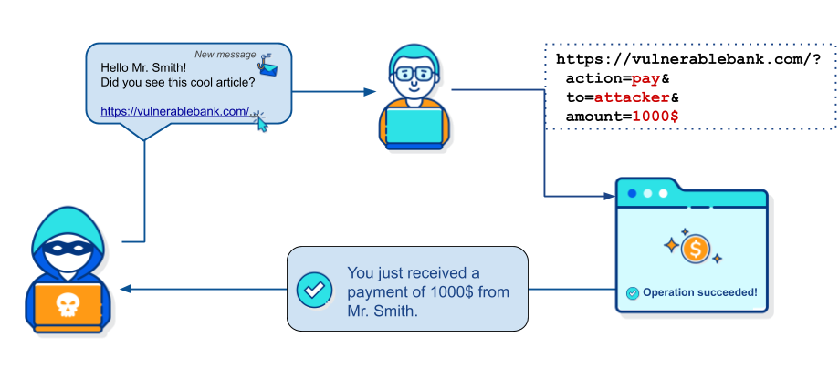
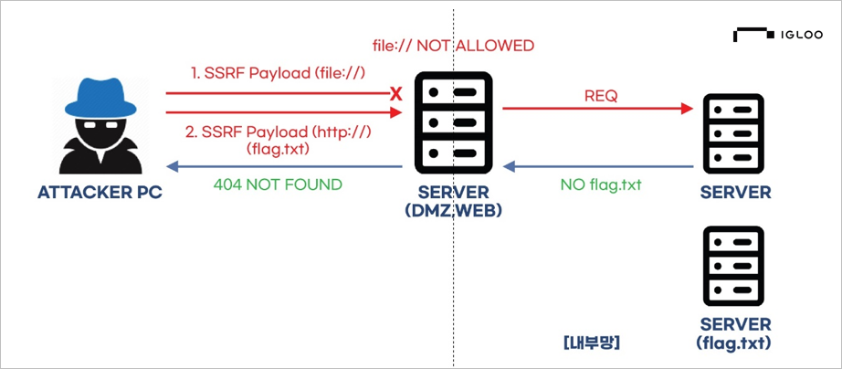

# CSRF & SSRF

## CSRF(Cross-Site Request Forgery)
### 크로스 사이트 요청 위조

[출처](https://knowledge-base.secureflag.com/vulnerabilities/cross_site_request_forgery/cross_site_request_forgery_vulnerability.html)

### 특징
- 인증된 사용자의 권한으로 웹사이트에 공격자가 원하는 요청을 보내도록 유도
- MITM 공격의 일종
- 공격 과정
    - 공격자가 요청이 포함된 링크를 희생자(victim)에게 전송(주로 무차별적인 공격)
    - 희생자가 링크를 클릭하면 브라우저에 저장된 정보를 사용하여 대상 서버에 요청을 보냄
    - 서버에서는 요청에 적절한 권한이 포함되어 있으므로 정상 처리

### 조건
- 희생자가 공격자가 만든 피싱 사이트(링크)에 접속할 것
    - 대부분의 경우 접속하는 순간 자동적으로 요청이 전송됨
- 희생자가 위조 요청을 보낼 사이트에 로그인되어 있을 것
    - 자동로그인이 되어 있는 경우 주의

### 예시
- 피싱 사이트 접속 후 희생자의 자금 전송
- 관리자 권한으로 회원 정보 수정, 삭제 등을 실행

### 방지 방법
#### 사용자 입장
- 브라우저에 비밀번호 저장하지 않기(자동로그인 x)
- 여러 웹사이트를 동시에 사용하지 않기
#### 서버 입장
- CSRF Token 사용
    - 사용자의 세션에 포함된 유니크한 키로, 요청마다 다른 값을 가지기 때문에 도용이 어려움
    - Spring security를 이용하면 쉽게 구현 가능
- Referrer 검증
    > Referrer: 어떤 경로로 사이트를 방문했는지에 대한 정보

    - 사용자의 referrer를 확인하여 도메인이 일치하는지 확인
    
- 토큰 기반 인증 방식 사용(ex. JWT 토큰)
    - 세션 기반이 아닌, 토큰 기반의 인증을 사용하여 요청마다 수동으로 정보를 헤더에 담아 전송
    - 쿠키가 자동으로 전송되지 않으므로 CSRF 방어가 가능하나, token을 localStorage에 저장하면 XSS 공격에 취약해질 수 있으므로 주의

## SSRF(Server-Side Request Forgery)
### 서버 사이드 요청 위조

[출처](https://www.igloo.co.kr/security-information/ssrf-%EC%B7%A8%EC%95%BD%EC%A0%90%EC%9D%84-%EC%9D%B4%EC%9A%A9%ED%95%9C-%EA%B3%B5%EA%B2%A9%EC%82%AC%EB%A1%80-%EB%B6%84%EC%84%9D-%EB%B0%8F-%EB%8C%80%EC%9D%91%EB%B0%A9%EC%95%88/)

- 사용자 없이 공격자가 웹서버에 직접 요청을 보냄
- 내부망에 직접 접근하여 인증 과정을 건너뛰거나, 인증 정보를 획득한 후 해당 정보를 포함시켜 요청을 보내는 방식으로 진행
- 공격 과정
    - 웹 서버의 취약점(URL을 통해 다른 서버에서 데이터를 가져오는 경우 발생할 수 있음)을 통해 내부망 IP 주소, port 상태를 알아냄
    - 알아낸 주소를 기반으로 원하는 정보에 해당하는 서브도메인을 찾아냄
    - 최종적으로 원하는 주소를 url에 직접 포함시켜 요청을 보냄

### 조건
- 어플리케이션이 다른 신뢰하는 어플리케이션/도메인에 요청을 보낼 수 있을 것

### 예시
- 관리자의 메타데이터를 탈취 후 DB에서 고객 정보 접근
- 내부망에서 기업 내부 시스템의 명령어 탈취

### 방지 방법
- 화이트리스트 기반의 검증
    > 블랙리스트 기반: 포함되어서는 안되는 내용이 포함되었는지 검사
    > 화이트리스트 기반: 사전 정의한 허용 목록에 포함된 내용인지 검사
    - 요청에 포함된 도메인, IP 주소가 화이트리스트(검증된 주소 목록)에 포함된 것인지 확인
    - URL을 검사할 때 문자열의 포함여부 뿐만아니라 위치와 불필요한 기호의 포함 여부를 정확하게 검사
- 요청 처리 서버와 중요 정보를 처리하는 내부 서버를 분리하여 공격을 받더라도 중요한 정보는 보호되도록 설정

### 추가로 공부할 내용
- SOP(Same-origin policy)
- CORS(Cross-origin resource sharing)
- preflight
- Port Scanning

#### 참고자료
> https://en.wikipedia.org/wiki/Cross-site_request_forgery
> https://tibetsandfox.tistory.com/11
> https://nordvpn.com/ko/blog/csrf/
> https://liltdevs.tistory.com/178
> https://stir.tistory.com/265
> https://medium.com/naver-cloud-platform/ssrf-공격의-피해-사례와-대응-1-d0be4b12d10a
> https://code-machina.github.io/2019/09/25/Server-Side-Request-Forgery-Prevention.html
> [SSRF 취약점을 이용한 공격사례 분석 및 대응방안](https://www.igloo.co.kr/security-information/ssrf-%EC%B7%A8%EC%95%BD%EC%A0%90%EC%9D%84-%EC%9D%B4%EC%9A%A9%ED%95%9C-%EA%B3%B5%EA%B2%A9%EC%82%AC%EB%A1%80-%EB%B6%84%EC%84%9D-%EB%B0%8F-%EB%8C%80%EC%9D%91%EB%B0%A9%EC%95%88/)