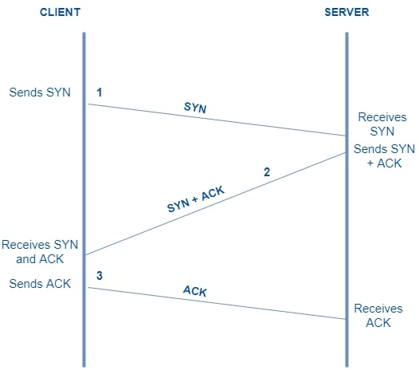

# TCP & UDP
## TCP(Transmission Control Protocol, 전송 제어 프로토콜)
### 정의
TCP는 연결형 서비스를 지원하는 양방향 통신 프로토콜로, 통신을 위해 호스트 간의 연결 방식과 데이터 형식을 규정한다. 

### 원리
- 데이터를 분할한 뒤 TCP 헤더를 붙여 세그먼트를 생성한다.
- 데이터를 전송할 때 사용하는 TCP Header에는 CONTROL BIT(6 bit)가 존재하는데, 각 위치는 URG-ACK-PSH-RST-SYN-FIN에 대한 정보를 담고 있다.
  - URG(Urgent): 해당 데이터를 우선적으로 처리해라
  - PSH(Push): 더이상 기다리지 말고 쌓인 데이터를 처리해라
  - RST(Reset): 연결을 재설정해라
  - **ACK(Acknowledgement)**: 패킷을 받았다
  - **SYN(Synchronize)**: 연결을 시작하겠다
  - FIN(Finish): 연결을 종료하겠다

- 3-way handshaking을 통해 연결을 수립하고, 연결을 수립한 이후 데이터를 주고받는다.
- 연결을 요청하는 경우 SYN bit를 1로 설정하고, 패킷을 받았음을 표현할 때 ACK bit를 1로 설정한다.
  

[출처](https://workat.tech/core-cs/tutorial/tcp-three-way-handshake-in-computer-networks-yoo7331910lh)
- 4-way handshaking을 통해 연결을 해제한다.
- 연결을 종료하고자 할 때 FIN bit를 1로 설정하고, 확인했음을 표현할 때 ACK bit를 1로 설정한다.
  

[Clemente](https://secure.wikimedia.org/wikipedia/commons/wiki/File:Fin_de_conexi%C3%B3n_TCP.svg)/[CC BY](https://commons.wikimedia.org/w/index.php?curid=15294601)

### 장점
- 데이터가 도착하는 것을 보장하므로 신뢰성이 보장된다.
- 데이터를 순차적으로 도착하도록 할 수 있다.

### 단점
- 일부 데이터가 손실되었을 경우에도 전체 데이터의 로딩으로 이어질 수 있다.
- UDP보다 느리다.
  
### 활용 예시
- 중간에 내용이 손실되면 안되는 경우
- 이메일, 문자 전송
- 파일 전송

## UDP(User Datagram Protocol, 사용자 데이터그램 프로토콜)
### 정의
UDP는 비연결형 프로토콜로, 실시간, 일방적 정보 전달을 목적으로 하여 최소한의 메커니즘을 가지고 있다.

### 원리
- 데이터의 도착 여부, 연결을 확인하지 않고 단순히 계속해서 패킷을 전송한다.

### 장점
- TCP보다 빠르다.
- 여러명에게 동시에 연결될 수 있다.

### 단점
- 무결성을 보장하지 않으므로 데이터가 중간에 손실될 수 있다
- 전송 순서가 유지되지 않는다.

### 예시
- 빠르게 전송해야하는 경우
- 실시간 온라인 게임
- 라이브 스트리밍
- 화상 통화

## Socket
- TCP/UDP를 실제로 구현하기 위해서는 Socket을 사용한다.
- Java의 경우 TCP는 ServerSocket 클래스, UDP는 DatagramSocket 클래스를 사용하여 구현한다.
- [TCP Java 구현](https://woolbro.tistory.com/29)
- [UDP Java 구현](https://woolbro.tistory.com/30)

### 추가로 공부할만한 내용
- SYN Flooding
- SYN Cookie
- TCP/UDP Header

### 참고 자료
https://massive.io/ko/file-transfer/what-is-transmission-control-protocol-tcp/
https://dev-coco.tistory.com/144
https://hojunking.tistory.com/106
https://www.avast.com/c-tcp-vs-udp-difference
https://velog.io/@averycode/%EB%84%A4%ED%8A%B8%EC%9B%8C%ED%81%AC-TCPUDP%EC%99%80-3-Way-Handshake4-Way-Handshake
