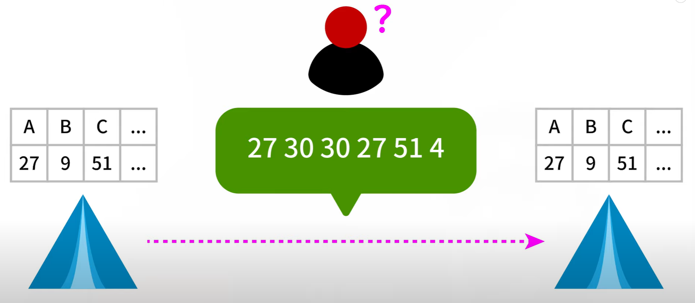

# TLS_SSL

## 대칭키/공개키 의 생성이나 체크하는 방식을 예시로 봤으면 합니다.

대칭키

공개키

초록 키로 암호화 하면 오른쪽 주황색 키로만 복호화 할 수 있음

초록색 키는 공개키, 오른쪽 키는 비공개(기관이 철저히 보호)

### 전자 서명이 포함된 인증서는 어떤 방법으로 신뢰도를 보장하는지 궁금합니다

클라이언트의 웹브라우저에는 유명한 CA(인증기관)의 목록과 그 공개키를 가지고 있는데, 이것을 이용하여 인증서를 복호화를 시도해보고, 완료되면 서버가 신뢰할 수 있는 대상임을 알 수 있게된다.

### TCP 프로토콜을 이용하기 때문에 성능 보완을 위해 UDP 기반의 보안 소켓이 필요하다고 했는데, 어떤 성능을 보완해야 하는 것이고, UDP 기반의 보안 소켓은 어떤 강점을 가지고 있는 것인가요?

성능은 통신 속도를 말하는 것이고, UDP 기반의 보안 소켓인 DTLS는 TLS의 기능을 UDP 계층 위에 그대로 구현한 암호화 프로토콜로 UDP의 장점인 성능상의 이점을 암호화 핸드쉐이크 과정에서도 극대화할 수 있다. DTLS는 암호화 알고리즘과 헤더 구조 등은 TLS와 동일하며 TCP 대신에 UDP를 사용함으로써 더욱 빠른 암호화 과정을 보장한다.

### TLS와 SSL의 차이점도 간단하게 설명해주시면 좋겠습니다.

TLS 버전 1.0은 SSL 버전 3.1을 기반으로 개발을 시작한 것으로, 넷스케이프와는 더 이상 관계가 없음을 명시하기 위해 발표 전에 프로토콜의 이름이 변경되었다. 넷스케이프는 3. 대 버전이 보안 취약점으로 인해 2015년에 사용 금지된 것을 마지막으로 마이크로소프트에 완전히 밀려 몰락하였다.

### TLS에서 pre-master secret과 master secret의 의미가 잘 이해가 가지 않아서 자세히 설명해주시면 좋겠습니다.

pre master secret은 뒤에 세션 단계에서 데이터를 실제로 주고 받을 때, 데이터들을 암호화하기 위해서 사용되는 것이다.  클라이언트는 자신의 랜덤 데이터와 인증서에 담겨있던 서버의 랜덤 데이터를 이용하여 pre master secret를 생성하여 서버에게 전달한다. 그 후, 클라이언트와 서버는 동일한 pre-master secret을 이용하여 일련의 과정을 거쳐 master secret을 만들고, 그 master secret을 이용하여 session key라는 대칭키를 만든다. 그리고 session key로 데이터들을 암호화해서 사용한다.

### TLS 작동방법 중 "서버는 전송받은 정보를 복호화하여 pre-master secret을 알아낸 뒤" 이 부분에서 복호화할때 다른 키는 필요없는건가요?

pre master secret은 서버의 공개 키로 암호화되며 복호화 할 때는 서버의 개인 키로 복호화하게 된다.

### TLS작동 방법 5번 - '서버가 보낸 인증서에 포함된 공개 키' 또한 메세지에 담겨서 전송되나요? 해당 키는 각 클라이언트별로(인증서별로) 다 다른건가요?

서버가 인증서를 가지고 있어서 굳이 담을 필요가 없어보임. 인증서 별 공개 키는 아래와 같이 확인 가능함

### 메세지 인증 코드(MAC)가 수신자에게 데이터 무결성을 어떻게 보장하나요?

MAC이란 메시지의 인증을 위해 메시지에 부가되어 전송되는 작은 크기의 정보이다. 비밀 키를 사용함으로써 데이터 인증과 무결성을 보장할 수 있다. 비밀 키와 임의 길이의 메시지를 MAC 알고리즘으로 처리하여 생성된 코드를 메시지와 함께 전송한다.
