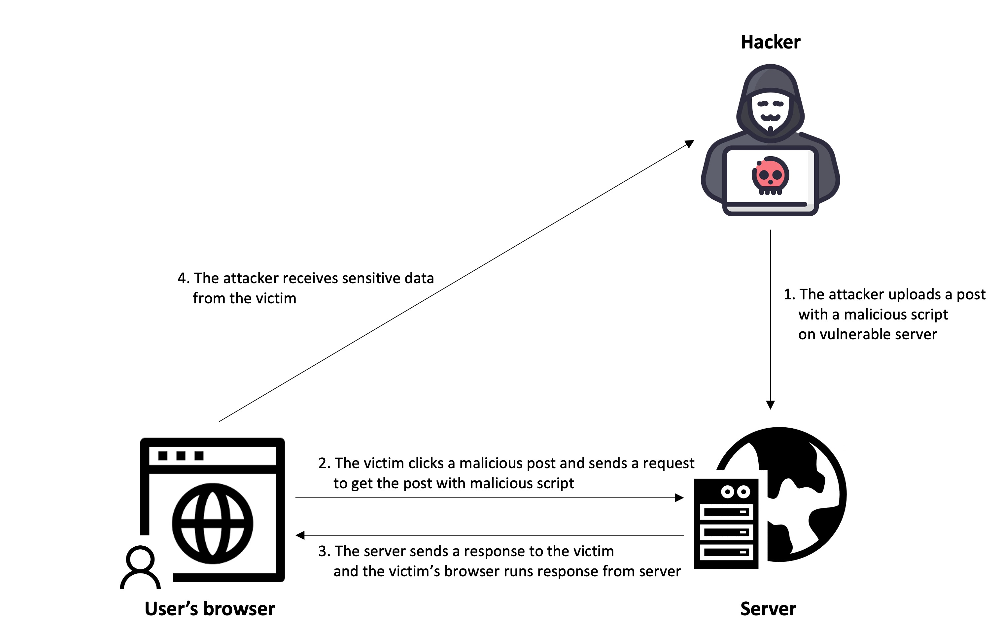
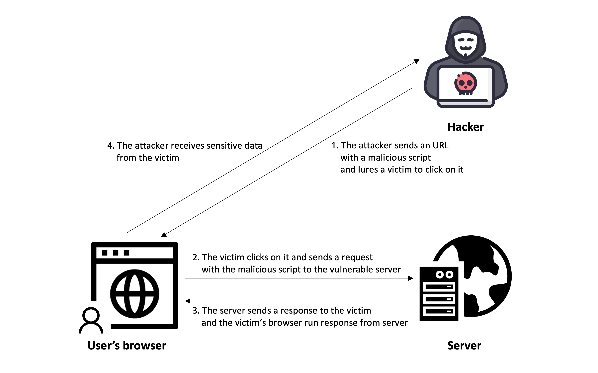

# XSS

## XSS란?

XSS는 Cross-site Scripting의 약자로, Cascading Style Sheet와의 혼동을 피하기 위해 XSS라고 줄이게 되었다. SQL injection과 함께 웹 상에서 가장 기초적인 취약점 공격 방법의 일종으로, 악의적인 사용자가 공격하려는 사이트에 스크립트를 넣는 기법을 말한다. 공격에 성공하면 사이트에 접속한 사용자는 삽입된 코드를 실행하게 되며, 보통 의도치 않은 행동을 수행시키거나 쿠키나 세션 토큰 등의 민감한 정보를 탈취한다.

대표적인 공격 방법은 Stored XSS와 Reflected XSS 두 가지가 있으며, 주로 CSRF를 하기 위해서 사용되기 때문에 종종 CSRF와 혼동되는 경우가 있으나, XSS는 자바스크립트를 실행시키는 것이고, CSRF는 특정한 행동을 시키는 것이므로 구분할 필요가 있다.

## Stored XSS

공격자가 제공한 데이터가 서버에 저장된 후 지속적으로 서비스를 제공하는 정상페이지에서 다른 사용자에게 스크립트가 노출되는 기법

<h3>Stored XSS 공격 시나리오</h3>
<ol>
<li>해커가 보안이 취약한 사이트를 발견</li>
<li>사이트에서 제공하는 게시판에 사용자 정보를 빼돌릴 수 있는 스크립트를 작성</li>
<li>사용자가 작성된 게시글을 읽으면, 서버로부터 악성 스크립트가 담긴 게시글 응답을 전달받음</li>
<li>사용자의 브라우저에서 응답 메시지를 실행하면서 악성 스크립트가 실행됨</li>
<li>악성 스크립트를 통해 사용자 정보가 악의적인 사용자에게 전달됨</li>
</ol>

## Reflected XSS

웹 어플리케이션의 지정된 파라미터를 사용할 때 발생하는 취약점을 이용한 공격법으로, Stored XSS와는 다르게 데이터베이스에 스크립트가 저장되지 않고 응답 페이지로 바로 클라이언트에 전달됨

<h3>Reflected XSS 공격 시나리오</h3>
<ol>
<li>해커가 보안이 취약한 사이트를 발견</li>
<li>사용자 정보를 빼돌릴 수 있는 스크립트가 담긴 URL을 만들어 일반 사용자에게 스팸 메일로 전달</li>
<li>사용자가 메일을 통해 전달받은 URL 링크를 클릭하여 브라우저에서 보안이 취약한 사이트로 요청을 전달</li>
<li>사용자의 브라우저에서 응답 메시지를 실행하면서 악성 스크립트가 실행됨</li>
<li>악성 스크립트를 통해 사용자 정보가 악의적인 사용자에게 전달됨</li>
</ol>

## XSS 방어 방법
1. 필터
    -  <, > 등의 특수문자(\<script>, \ 등의 태그를 이용하여 공격하므로)를 치환하는 XSS 필터를 만든 뒤, web.xml에 선언하여 모든 파라미터가 해당 필터를 거치도록 한다.
2. 쿠키의 보안 옵션 사용
    - 쿠키 생성시 '보안 쿠키'라는 파라미터를 지정하면 TLS 상에서만 사용하게 할 수 있으며, 'HTTP ONLY'라는 파라미터로 웹 브라우저상에서만 쓸 수 있게 할 수도 있다.
3. 콘텐츠 보안 정책 (Content Security Policy, CSP) 사용
    - 스크립트 실행에 대한 정책(조건)을 설정해 알 수 없는 스크립트가 실행되는 것을 예방할 수 있다. 원래는 외부 서버의 스크립트 파일이 script 태그나 iframe 등 사이트에 로드가 되면 스크립트가 실행되지만, CSP를 설정해 출처가 자기 서버인 스크립트만 실행되도록 할 수 있다.

##  XSS 공격 방지 7계명
0. 허용된 위치가 아닌 곳에 신뢰할 수 없는 데이터가 들어가는것을 허용하지 않는다.
1. 신뢰할 수 없는 데이터는 검증을 하여라.
2. HTML 속성에 신뢰할 수 없는 데이터가 들어갈 수 없도록 하여라.
3. 자바스크립트에 신뢰할 수 없는 값이 들어갈 수 없도록 하여라.
4. CSS의 모든 신뢰할 수 없는 값에 대해서 검증하여라.
5. URL 파라미터에 신뢰할 수 없는 값이 있는지 검증하여라.
6. HTML 코드를 전체적으로 한번 더 검증하여라.

## 참고 자료
https://junhyunny.github.io/information/security/spring-mvc/stored-cross-site-scripting/
https://www.youtube.com/watch?v=bSGqBoZd8WM
https://junhyunny.github.io/information/security/spring-mvc/reflected-cross-site-scripting/

## Q&A
### 설명해주신 방식 외에도 DOM Based XSS, Universal XSS라는 공격도 있던데 원리가 좀 다른 것 같아서 같이 설명해주시면 좋겠습니다!

DOM(Document Object Model) Based XSS
- 보안에 취약한 JavaScript 코드로 DOM 객체(문서 객체 모델)를 제어하는 과정에서 발생.

Universal XSS
- 클라이언트 측 취약점으로 브라우저 안에 악성 스크립트를 실행
- 브라우저 자체의 취약점이나 확장 기능 또는 플러그인의 취약점을 악용

### stored xss 는 단순히 브라우저 사용자에게 특정 정보를 보여주는 것 뿐인가요?
악성 스크립트 실행을 통해 사용자의 정보가 해커에게 빠져나가게 됩니다.

### 악성 스크립트는 어떤 방법으로 사용자의 정보를 빼돌리나요?
쿠키를 탈취 후 공격자의 웹 사이트로 리다이렉트하는 방법 등으로 정보를 빼돌리게 됩니다.
