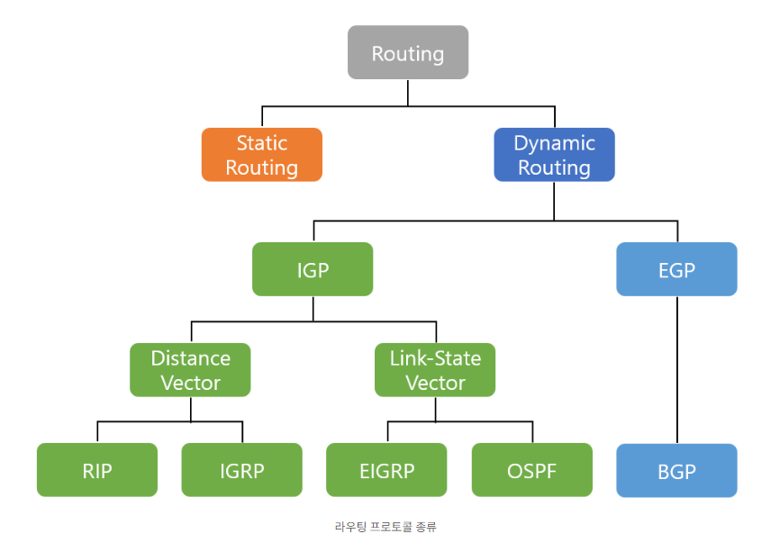
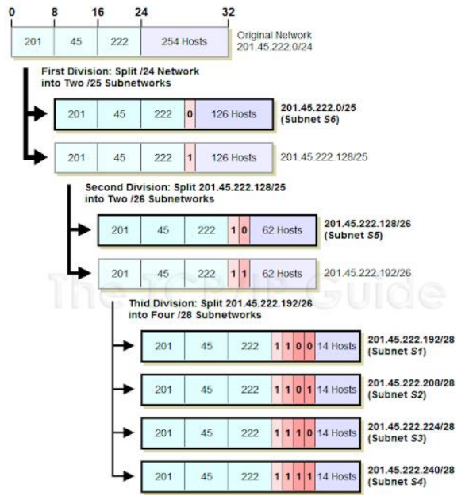

# 라우팅

## 정의
&ensp;네트워크에서 데이터의 전달 단위를 의미하는 패킷(PACKET)이 효율적으로 출발지부터 일반적으로 라우터, 브릿지, 게이트웨이 등으로 불리는 중간 노드들을 거쳐 최종 목적지까지 최단거리 또는 최단 시간에 전달될 수 있도록 하는 과정을 총괄 하는 것이 라우팅(Routing)이다.

## 라우팅 분류

+ AS(Autonomous System)  
&ensp;하나의 단일 기관 하에서도 동일한 정책으로 관리되는 네트워크와 라우터 그룹. 하나의 AS는 반드시 동일한 라우팅 알고리즘 사용. (ex) KT, SKT 등등...

+ 정적 라우팅  
&ensp;경로 정보를 미리 라우터에 수동으로 입력하여 송수신 하는 방식. 빠르지만 메모리가 더 들고 바꿀 때마다 번거롭다는 단점이 있다.

+ 동적 라우팅  
&ensp;네트워크의 현재 상황에 따라 라우터에서 사용하는 경로 정보를 적절하게 변경하는 방식. 변경에 용이하고 편리하며 아래와 같이 두 종류로 나뉜다.

    + IGP (Interior Gateway Protocol)  
    AS 내부에서 이루어지는 라우팅

    + EGP (Exterior Gateway Protocol)  
    AS 간에 이루어지는 라우팅

+ IGP  
&ensp;AS 내부에서 이루어지는 라우팅과 관련된 프로토콜들의 집합으로 라우팅을 구현하는 알고리즘 방식에 따라 아래와 같이 나뉜다.
    + Distance Vector  
    벨만-포드 알고리즘 활용 (ex. RIP, IGRP...)
    + Link-State  
    다익스트라 알고리즘 활용 (ex. EIGRP, OSPF...)

+ EGP  
&ensp;AS 간에 라우팅을 담당하는 프로토콜로 대표적으로 BGP가 있다.
     

# IP

## 정의

&ensp;인터넷 프로토콜(Internet Protocol)의 약자로, 인터넷이 통하는 네트워크에서 어떤 정보를 수신하고 송신하는 통신에 대한 규약을 의미한다. Host에서 Host까지의 통신, 즉 보내는 컴퓨터에서 받는 컴퓨터까지의 통신을 책임진다.

## IP Addressing (IPV4 기준)

### 개념

&ensp;IP 주소는 Host를 식별하기 위해 사용하는 주소로, 32비트의 값을 가진다. 보통 8비트씩 끊어 이를 0~255의 10진수 숫자로 나타내며, 각 숫자는 점(.)으로 구분한다. (ex) 223.1.1.1 등등..

&ensp;상위 비트들은 Subnet에 대한 정보를 나타내고 하위 비트들은 Subnet 내의 각각의 Host들을 나타낸다. 이때 Subnet은 Host들을 모은 네트워크를 지칭하는 주소로 네트워크 주소가 동일한 네트워크를 로컬 네트워크라고 한다.
  

### 서브네팅

&ensp;서브네팅(Subnetting)은 네트워크 관리자가 네트워크 성능을 향상시키기 위해, 자원을 효율적으로 분배하는 것이다. 다시 말해, IP 주소 낭비를 방지하기 위해 원본 네트워크를 여러개의 서브넷으로 분리하는 과정을 뜻한다. 서브넷 마스크(Subnet Mask)를 통해 네트워크 ID와 Host ID를 구분한다.  

  

### 고정 주소들(+@)

&ensp;네트워크 주소(Network address)는 Host 주소가 모두 0인 주소로, 네트워크를 구별하기 위한 네트워크 주소로 사용되기 때문에 각 기기들이 통신하기 위한 고유 번호로는 사용되지 않는다.

&ensp;브로드캐스트 주소(Broadcast adddress)는 Host 부분이 모두 1인 주소로 특정 네트워크에 속하는 모든 Host/Client들이 듣게 되는 주소이다.
목적이 있는 주소이기 때문에, 이 또한 각 기기들이 통신하는 고유 번호로 사용되지 않는다.
     

# MAC

## 정의

&ensp;매체 접근 제어(Media Access Control)의 약자로, 매체 접근 제어는 유선(전기 또는 광학) 또는 무선 전송 매체와의 상호 작용을 담당하는 하드웨어를가지고호 제어하는 방식이다.

## MAC Address
&ensp;컴퓨터간 통신 과정에서 서로를 구분하고 인식하기 위해 MAC 주소는 네트워크의 데이터 링크 계층에서 통신을 위한 네트워크 인터페이스 카드(NIC)에 할당된 고유 식별자로 물리적인 네트워크 장치를 식별한다. 인터넷은 TCP/IP로 통신을 하고 이때 IP주소를 사용하는데 이를 실질적인 물리적 주소인 MAC 주소로 바꾸는 절차 (ARP : Address Resolution Protocol)가 존재한다.  

### ARP

&ensp;ARP(Address Resolution Protocol)는 네트워크에서 IP 주소를 가지고 있는 Host의 IP 주소를 물리적인 MAC 주소로 매핑하는 프로토콜로 다음과 같은 과정들이 존재한다.

1. ARP 요청 (ARP Request)  
Host A는 목적지 Host B의 IP 주소를 알고 있지만 MAC 주소를 모를 때 Host A는 ARP 요청 패킷을 로컬 네트워크에 브로드캐스트한다. 이 ARP 요청에는 Host A의 IP 주소와 MAC 주소, 그리고 목적지 IP 주소가 포함된다.

2. ARP 응답 (ARP Reply)  
브로드캐스트된 ARP 요청을 받은 Host B는 자신의 IP 주소와 일치하는 목적지 IP 주소를 확인하고, 자신의 MAC 주소를 ARP 응답 패킷에 포함하여 Host A로 전송한다.

3. MAC 주소 매핑 (MAC Address Mapping)  
Host A는 ARP 응답을 받으면 목적지 Host B의 MAC 주소를 받게 되고, 이를 ARP 캐시에 저장한다. 이후에는 ARP 요청을 다시 보내지 않고도 목적지 Host B로 패킷을 전송할 수 있게 된다.
  

### MAC Address를 이용한 통신과정

+ 같은 네트워크 내에서 통신  
    1. 두 컴퓨터 A, B 존재. A가 B와 통신하고 싶고 B의 IP주소를 알고 있음.
    2. A는 자기가 속한 네트워크에 있는 모든 pc에게 브로드캐스팅을 통해 B가 존재하면 MAC 주소를 전송하도록 요청을 보냄.
    3. 이 경우 같은 네트워크에 있기 때문에 B는 A가 보낸 Broadcast를 받게됨.
    4. B는 A에게 MAC 주소를 알려주게 되고 통신을 시작함.

+ 다른 네트워크 간 통신  
    1. 두 컴퓨터 A, B 존재. A가 B와 통신하고 싶고 B의 주소를 알고 있음.
    2. A는 자기가 속한 자기가 속한 네트워크에 있는 모든 pc에게 브로드캐스팅을 통해 B가 존재하면 MAC 주소를 전송하도록 요청을 보냄.
    3. 이 경우 같은 네트워크에 없기 때문에 라우터가 그 정보를 받아 다른 네트워크에 존재하는 B를 찾음. 이때 받는 MAC 주소를 라우터의 MAC 주소로 변경하여 보냄.
    4. B를 찾고 나면 A에게 MAC 주소를 알려주게 되고 통신을 시작함.

        

# QnA

## 1. 라우팅의 흐름을 간략하게 설명해주시면 좋겠습니다.  

## 2. 각 라우팅 방식의 장단점이나 선택 기준?이 궁금합니다.  
1. 정적 라우팅 (Static Routing):
    + 장점:
        + 구성이 간단하고 운영이 간편합니다.
        + 작은 네트워크나 단일 경로에 적합합니다.
    + 단점:
        + 네트워크 구조 변경 시 수동으로 업데이트해야 합니다.
        + 동적인 네트워크에서는 유연성이 부족합니다.
2. 동적 라우팅 (Dynamic Routing):

    + 장점:
        + 네트워크 구조 변경 시 자동으로 업데이트됩니다.
        + 더 큰 네트워크에서 효과적입니다.
    + 단점:
        + 구성이 복잡하고 운영이 조금 더 어렵습니다.
        + 불필요한 트래픽을 발생시킬 수 있습니다.  

사실 요즘 대부분의 경우에는 네트워크의 사이즈가 크기 때문에 동적 라우팅이 주로 사용되고 아주 간혹 네트워크의 사이즈가 작거나 보안이 중요한 곳에서만 정적 라우팅이 드물게 사용하고 있음  

## 3. ip와 mac이 1:1 대응되는 것이라면 왜 두 주소를 따로 관리하는지 궁금합니다.(두 방식의 차이점?)  
ip 주소는 기기에 고정되지 않고 네트워크 상태에 따라 계속 변할 수 있기 때문에 물리적 주소인 mac 주소가 있어야만 최종적으로 원하는 장치를 식별할 수 있기 때문.

## 4. 서브네팅에서 네트워크를 분리한다고 했는데 이게 ip 주소를 분리하는 건가요 아니면 통신을 분리하는 건가요  
1. 서브네팅은 주로 IP 주소를 분리하는 데 사용됩니다. 각 서브넷은 특정 범위의 IP 주소를 할당받고, 이를 통해 호스트들은 자신이 속한 서브넷의 IP 주소를 사용하여 통신합니다. 이러한 IP 주소의 분리는 네트워크를 논리적으로 분리하여 브로드캐스트 도메인을 제한하고, 라우팅을 관리하는 등의 목적으로 사용됩니다.  
2. 서브네팅은 또한 통신을 분리하는데도 사용될 수 있습니다. 서브넷은 라우터를 통해 서로 다른 네트워크와 통신할 수 있지만, 브로드캐스트 메시지는 각 서브넷의 범위 내에서만 전파됩니다. 따라서 서브네팅은 특정 그룹이나 부서와 같은 내부적인 통신을 제한하거나 분리하는 데도 사용될 수 있습니다.

## 5. 서브네팅에서 원본 네트워크를 여러개의 서브넷으로 분리하는것이 어떻게 네트워크 성능을 향상시키는것인지 궁금합니다.  
1. 트래픽 분산: 서브네팅을 통해 네트워크를 더 작은 서브넷으로 나누면 각 서브넷은 더 적은 장치를 포함하게 됩니다. 따라서 네트워크 트래픽이 더 분산되어 각 서브넷에 더 적은 트래픽 부하가 발생하게 됩니다. 이로 인해 더 효율적인 트래픽 관리가 가능해지며, 네트워크의 성능과 응답 시간이 개선될 수 있습니다.  
2. 브로드캐스트 도메인 제한: 대형 네트워크에서는 브로드캐스트 트래픽이 전체 네트워크를 횡단하여 대역폭을 소모하고 네트워크 성능을 저하시킬 수 있습니다. 서브네팅을 통해 네트워크를 여러 개의 서브넷으로 나누면 각 서브넷은 별도의 브로드캐스트 도메인으로 분리되어 브로드캐스트 트래픽이 해당 서브넷으로만 제한됩니다. 이로 인해 브로드캐스트 트래픽이 네트워크 전체에 퍼지지 않고 제어될 수 있으며, 전체 네트워크의 성능이 향상될 수 있습니다.  
3. 경로 최적화: 서브네팅을 통해 더 작은 서브넷으로 네트워크를 나누면 라우팅이 더 효율적으로 이루어질 수 있습니다. 각 서브넷은 더 짧은 경로를 통해 도달할 수 있으며, 이는 라우팅 테이블의 크기를 줄이고 더 빠른 경로 선택을 가능하게 합니다.  

## 6. 하나의 AS는 반드시 동일한 라우팅 알고리즘을 사용한다고 했는데, EGP는 AS 간에 이루어지는 라우팅이므로 다른 라우팅 알고리즘이 사용되어도 되나요?  
AS 간 라우팅에서는 다른 AS와의 연결 및 경로 선택 등의 요소가 중요  
이는 AS 내 라우팅과 다른 고려 요소들이 존재하므로 다른 라우팅 알고리즘이 사용될 수 있음. 따라서 AS 간 라우팅에서는 AS 내부의 라우팅 알고리즘과는 별도로 다른 라우팅 알고리즘이 사용됩니다.

## 7. IP에서 상위 비트, 하위 비트가 무엇인가요? 그림에서처럼 왼쪽에 있는 게 상위 비트이고 오른쪽이 하위 비트인가요?  
IP 주소 => 네트워크 주소 + 호스트 주소  
네트워크 주소 -> 서브넷 마스크 비트 수만큼 (상위) / 나머지 -> 호스트 주소
