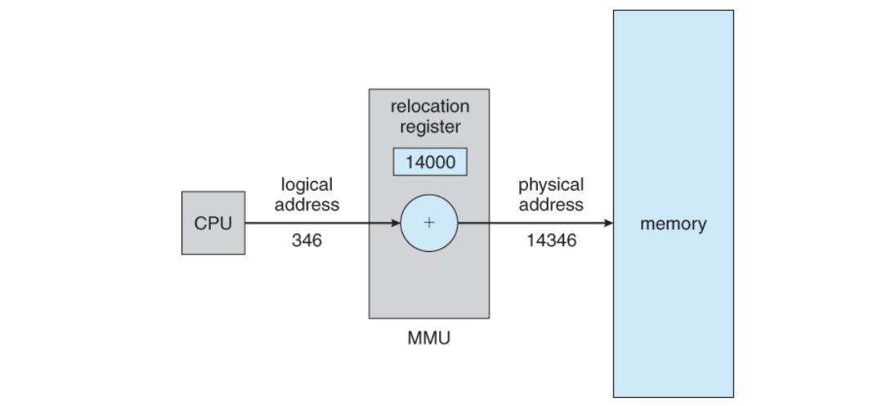
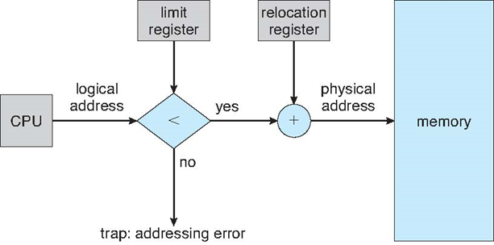

# 메모리란?
메모리란 프로그램과 프로그램 수행에 필요한 데이터 및 코드를 저장하는 장치이다.
메모리는 크게 내부 기억장치인 주기억장치와 외부 기억장치인 보조 기억장치로 분류되는데
DRAM, CPU 안에 있는 레지스터(register)와 캐쉬(cache memory) 등이 전자에 해당되고
SSD, HDD 등이 후자에 해당된다.

### 1. RAM (Random Access Memory)  
RAM은 프로그램이 실행되는 동안 필요한 데이터 및 명령을 저장하는 데 사용되며 주소를 통해 직접 데이터에 액세스할 수 있고 휘발성 메모리이며 프로그램 실행, 데이터 저장 등에 사용된다.

### 2. ROM (Read-Only Memory)  
ROM은 컴퓨터의 부팅 프로세스 및 시스템 설정과 같은 핵심 프로그램 및 데이터를 저장한다. 읽기 전용 메모리이기 때문에 내용을 수정할 수 없고 비휘발성이며 부트 로더, 펌웨어, 시스템 BIOS 등에 사용된다.

### 3. 캐시 메모리 (Cache Memory)  
캐시 메모리는 CPU가 자주 액세스하는 데이터를 임시로 저장하여 전체 시스템 성능을 향상시켜 빠른 액세스 속도를 가지며 일반적으로 L1, L2, L3 캐시로 구분된다. 주로 CPU 성능 향상 및 전력 소모 감소를 위해 사용된다.

### 4. 보조 저장 장치 (Secondary Storage)  
보조 저장 장치는 데이터를 장기적으로 저장하고 영구적으로 유지한다. 예시로는 하드 디스크 드라이브 (HDD), 솔리드 스테이트 드라이브 (SSD)가 존재한다. 비휘발성이며 큰 용량을 제공하여 데이터 저장, 파일 시스템 운영 등에 사용된다.

### 5. 가상 메모리 (Virtual Memory)  
가상 메모리는 물리적 메모리의 부족을 보완하여 큰 프로그램 및 데이터를 실행할 수 있도록 한다.
물리적 메모리를 확장하는 역할을 하며 디스크 공간을 사용하여 메모리 부족 문제 해결, 여러 프로그램 동시 실행 등에 사용된다.   

# 가상메모리 (Virtual Memory)  

## 등장 배경
1. 초창기 컴퓨터에서는 사용 가능한 RAM의 용량이, 가장 큰 실행 애플리케이션의 주소 공간보다 커야만 실행이 가능했다.   
2. 이후 컴퓨터에서는 프로그래머가 애플리케이션의 일부분만 기억장치에 올려 실행하도록 지정할 수 있게 하는 오버레이 기법을 사용하여 메모리 부족 문제를 해결하고자 했었다.   
3. 가상 메모리 기법은 애플리케이션을 실행하는 데 얼마나 많은 메모리가 필요한지에 집중하지 않고, 대신 애플리케이션을 실행하는 데 최소한 얼마만큼의 메모리가 필요한가에 집중하여 문제를 해결하고자 하였다.    
4. 메모리 접근은 순차적이고 지역화되어 있기 때문에 적용될 수 있었고 이렇게 애플리케이션의 일부분만 메모리(기억장치)에 올려지며 메모리에 올라가지 않는 나머지는 보조 기억장치, 즉 디스크에 위치시키게 되었다.   

## 아이디어  

1. 어떤 프로세스가 실행될 때 메모리에 해당 프로세스 전체가 올라가지 않더라도 실행이 가능하다.  
2. 따라서 애플리케이션이 실행될 때, 실행에 필요한 일부분만 메모리에 올라가게 하고 나머지는 디스크에 남겨두어 디스크가 RAM의 보조 기억장치(backing store)처럼 작동하게 할 수 있다.  
3. 결국 빠르고 작은 기억장치(RAM)을 크고 느린 기억장치(디스크)와 병합하여, 하나의 크고 빠른 기억장치(가상 메모리)처럼 동작하게 하는 것임.  
4. 대신 이런 병합된 모습의 가상 메모리를 구현하기 위해서 컴퓨터는 특수 메모리 관리 하드웨어를 갖추어야 한다. ⇒  MMU(Memory Management Unit)!

## MMU (Memory Management Unit)

1. MMU는 가상주소를 물리주소로 변환하고, 메모리를 보호하는 기능을 수행한다.  
2. MMU를 사용하게 되면, CPU가 각 메모리에 접근하기 이전에 메모리 주소 번역 작업이 수행됨.  
3. 그러나 메모리를 일일이 가상 주소에서 물리적 주소로 번역하게 되면 작업 부하가 너무 높아지므로, MMU는 RAM을 여러 부분(페이지, pages)로 나누어 각 페이지를 하나의 독립된 항목으로 처리함.  

### MMU의 메모리 보호  
프로세스는 독립적인 메모리 공간을 가져야하므로 MMU는 한 프로세스에게 합법적인 주소 영역을 설정하고, 잘못된 접근이 오면 trap을 발생시키며 보호한다. base와 limit 레지스터를 활용하여 이를 구현한다.  
- base 레지스터 : 메모리상의 프로세스 시작주소를 물리 주소로 저장
- limit 레지스터 : 프로세스의 사이즈를 저장

프로세스의 접근 가능한 합법적인 메모리 영역(x)은 base <= x < base+limit 인 부분이다. 이 영역 밖에서 접근을 요구하면 trap을 발생시킨다.

    

# QnA

## 물리 주소와 가상 주소가 뭔지? 가상 주소를 물리 주소로 변환한다는 것이 무엇인지?

가상 주소(Virtual Address):  

가상 주소는 각 프로세스가 자신만의 독립적인 주소 공간을 갖는 것으로, 프로세스가 직접 사용하는 주소입니다. 가상 주소는 프로세스가 메모리에 액세스할 때 사용되며, 프로세스가 실제로 물리적인 메모리 주소를 알 필요가 없도록 합니다. 이것은 가상 메모리 시스템에서 사용되는 개념으로, 프로세스가 실제 메모리보다 큰 가상 메모리 공간을 사용할 수 있게 해줍니다.

물리 주소(Physical Address):  

물리 주소는 컴퓨터의 실제 메모리(RAM)에서 데이터 또는 명령을 저장하는 데 사용되는 실제 주소입니다. 이 주소는 하드웨어 수준에서 사용되며, 각 메모리 셀을 식별하고 데이터를 저장하거나 검색하는 데 사용됩니다.

가상 주소를 물리 주소로 변환하는 과정은 주로 하드웨어와 운영체제가 함께 수행하는 작업입니다. 가상 주소를 물리 주소로 변환하는 프로세스를 주소 변환(address translation)이라고 합니다. 이 과정에서 운영체제의 메모리 관리 단위는 가상 주소를 물리 주소로 매핑하는 작업을 수행하는 주소 변환 테이블을 관리합니다. CPU가 메모리에 액세스할 때, 가상 주소가 물리 주소로 변환되어 해당 메모리 위치에 액세스할 수 있습니다.

즉, 가상 주소를 물리 주소로 변환하는 것은 프로세스가 사용하는 가상 주소를 실제 메모리에 있는 해당 위치로 매핑하는 것을 의미합니다. 이를 통해 가상 메모리 시스템이 실제 메모리를 효율적으로 사용하고, 프로세스 간의 격리를 유지하며, 메모리 관리를 보다 효율적으로 수행할 수 있습니다.  

## 페이징 개념에 대해서 궁금한데 부연 설명

페이징은 가상 메모리를 물리적인 페이지 단위로 관리하는 방법입니다. 메모리를 작은 크기의 페이지로 나누고, 이 페이지들을 가상 주소 공간과 실제 물리적 메모리 공간 사이에서 매핑합니다. 각 페이지는 고정된 크기를 가지며, 일반적으로 4KB 또는 8KB로 설정됩니다. 이렇게 하면 프로세스가 요청한 페이지만 메모리에 로드할 수 있고, 더 많은 페이지가 필요한 경우 디스크에서 추가 페이지를 가져와 사용할 수 있습니다. 일반적으로 페이징된 시스템에서는 가상 메모리와 물리 메모리 각각의 페이지 크기가 동일합니다.  

## 메모리에 부모 프로세스+실행에 필요한 자식 프로세스의 일부가 올라간다고 이해하면 될까요?

부모 프로세스(Parent Process):

부모 프로세스는 다른 프로세스를 생성하고, 그들의 실행을 제어하는 주체입니다. 일반적으로 부모 프로세스는 자식 프로세스를 생성하고, 자식 프로세스의 실행이 필요한 경우 부모 프로세스와 함께 메모리에 올라갑니다.
부모 프로세스는 메모리에 올라가는 동안에는 자신의 코드, 데이터, 스택 등이 포함됩니다.

자식 프로세스(Child Process):

자식 프로세스는 부모 프로세스에 의해 생성되는 프로세스입니다. 자식 프로세스는 종종 부모 프로세스의 기능을 확장하거나 독립적인 작업을 수행하는 데 사용됩니다. 필요에 따라 자식 프로세스는 메모리에 올라가는데, 이때는 자식 프로세스가 실행에 필요한 코드, 데이터, 스택 등이 포함됩니다.

따라서 프로그램 실행 중에 메모리에는 부모 프로세스와 일부 자식 프로세스가 올라와 있다고 볼 수 있습니다.  

## 가상 메모리를 사용하여도 RAM의 용량이 실행에 필요한 최소한의 용량보다 작으면 실행이 안되는걸까요?

위의 설명대로 실행되어야 할 프로세스는 RAM 위에 올라와야 합니다. 어떤 특정 프로세스가 RAM의 용량보다 커야한다면 그 프로세스는 실행되지 못할 것입니다.
