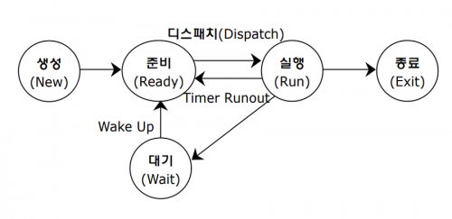

# 프로세스
### 정의
컴퓨터나 단말기의 응용 프로그램 등 단위 실행 프로그램
프로그램이 메모리에 적재되면 프로세스라고 표현하며 프로세스는 프로그램 한 개의 인스턴스라고 볼 수 있음

### 특징
- 각 프로세스들은 독립적인 영역을 가지며 다른 프로세스와 메모리 영역을 공유하지 않음

### 역할에 따른 종류
- **커널(시스템) 프로세스**: 프로세스 실행 순서를 제어하거나 사용자 프로세스를 생성하는 프로세스
- **사용자 프로세스**: 사용자 코드를 수행하는 프로세스

### 프로세스 상태 변화
 
[출처](https://itwiki.kr/w/%ED%94%84%EB%A1%9C%EC%84%B8%EC%8A%A4_%EC%83%81%ED%83%9C)
- **디스패치(Dispatch)**: 준비 상태의 프로세스가 메모리를 할당받고 실행 상태로 바뀌는 것
- **타이머 인터럽트(Timer interrupt, Timer runout)**: 하나의 프로세스가 프로세서를 독점하지 않도록 실행 중인 프로세스를 종료

### 프로세스 제어블록(Process Control Block)
- 운영체제가 스케줄링을 위해 프로세스의 정보를 저장하는 데에 사용하는 자료구조
  > **스케줄링**: 여러 프로세스가 번갈아가며 사용하는 자원(ex. CPU)를 언제 어디에 할당할지 결정하는 것
- 포함되어 있는 항목
  - 프로세스 식별자(Process Id): 프로세스 식별 번호
  - 프로세스 상태
  - 프로그램 카운터: 프로세서가 다음에 실행할 명령어의 주소(컨텍스트 스위칭을 하는 경우 필요)
  - CPU 레지스터
  - CPU 스케줄링 정보: 프로세스 우선순위 등
  - 메모리 관리 정보: 페이지 테이블 등
  - 입출력 상태 정보: 프로세스에 할당된 입출력 장치 목록
  - 어카운팅 정보: 사용된 CPU 시간, 시간 제한 등

## 멀티 태스킹
> **프로세서**: 프로세스를 처리하는 주체인 CPU
- 원래 프로세서는 한번에 하나의 일만 처리 가능하지만, 운영체제가 빠른 속도로 프로세스를 교체하기 때문에 여러 개가 동시에 실행되는 것처럼 보임
- 프로세스를 교체하는 것을 **컨텍스트 스위칭(Context switching)** 이라고 함

## 멀티 프로세싱
- 한 컴퓨터 내에서 2개 이상의 프로세서들이 서로 다른 부분을 동시에 처리
- 하나의 CPU 내에서 듀얼, 쿼드 코어 등을 사용하거나 여러개의 CPU를 사용할 수 있음

## 멀티 프로세스
- 하나의 프로세스를 여러 개의 프로세스로 분리하여 처리하는 것
- 부모 프로세스와 자식 프로세스로 이루어짐
### 장점
- 하나의 자식 프로세스에 문제가 생기더라도 전체 프로세스는 동작 가능함
### 단점
- 자식 프로세스 간에도 컨텍스트 스위칭이 이루어지면서 비용 발생

### 참고자료
https://velog.io/@jhon3242/Process-%EB%9E%80-%EB%AC%B4%EC%97%87%EC%9D%B8%EA%B0%80
https://inpa.tistory.com/entry/%F0%9F%91%A9%E2%80%8D%F0%9F%92%BB-multi-programming-tasking-processing
https://www.crocus.co.kr/1373
https://yummy0102.tistory.com/401
https://dar0m.tistory.com/197
https://itwiki.kr/w/%ED%94%84%EB%A1%9C%EC%84%B8%EC%8A%A4_%EC%83%81%ED%83%9C