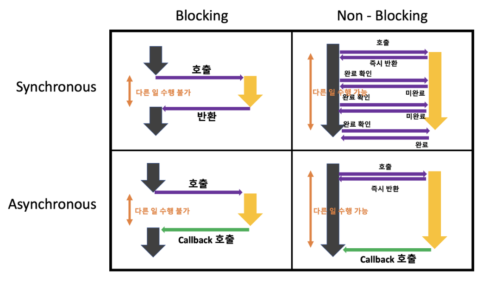

## 동기(Synchronous) / 비동기(Asynchronous)

- 동기 방식 : 직렬적으로 작업을 수행하는 모델로, 요청이 들어오면 순차적으로 작업을 수행하고, 해당 작업이 수행중이면 다음 작업은 대기하게 된다.


- 비동기 방식 : 동기 방식과는 반대로 직렬적으로 작업을 수행하여 요청이 들어오면 해당 요청에 의한 작업이 끝나지 않았더라도 계속 요청을 받는다. 각 요청에 대한 작업이 끝났다는 이벤트가 오면 해당 요청을 처리한다.


## 두 방식의 비교
- 동기 방식
    - 비동기 방식에 비해 디자인이 간단하고 직관적이다
    - 결과가 주어질 때 까지 아무것도 못하고 대기해야하는 문제가 있다
    - 카페에서 줄을 서서 주문하고, 메뉴가 나오면 다음 손님을 받는 방식

- 비동기 방식
    - 결과가 주어지는데 시간이 걸려도 그 시간동안 다른 작업을 할 수 있어서 보다 효율적이다.
    - 서버는 한번에 많은 요청이 들어오고 동시에 많은 요청을 처리해야하기 때문에 네트워크 관리에 최적화된 모델이다
    - 카페에서 메뉴를 주문하면 진동벨을 배부하고, 메뉴 준비가 완료되면 진동벨을 통해 알림을 보내는 방식


## Blocking / Non-Blocking
블로킹과 논블록킹은 다른 요청의 작업을 처리하기 위한 현재 작업의 block 여부를 나타내는 프로세스의 실행 방식이다. <br/>
동기/비동기가 전체적인 작업에 대한 순차적인 흐름 유무라면, 블로킹/논블로킹은 전체적인 작업의 흐름 자체를 막냐 안 막냐로 볼 수 있는 것이다. 예를 들어, 파일을 읽는 작업이 있을 때, 블로킹 방식으로 읽으면 파일을 다 읽을 때까지 대기하고, 논블로킹 방식으로 읽으면 파일을 다 읽지 않아도 다른 작업을 할 수 있다.


## 동기/비동기 + 블로킹/논블로킹 조합
- Sync Blocking (동기 + 블로킹)
- Async Blocking (비동기 + 블로킹)
- Sync Non-Blocking (동기 + 논블로킹) 
- Async Non-Blocking (비동기 + 논블로킹)




## 콜백 함수
비동기 논블로킹이란 다른 작업의 결과를 기다리지 않고 병렬적으로 실행되는 방식을 말하는데, 이때 다른 작업의 완료 여부나 결과에 대한 후처리를 위해 이용되는 방식이 콜백 함수이다.

```javascript
$.ajax({
  url: 'https://jsonplaceholder.typicode.com/todos/1', 
  type: 'GET', 
  dataType: 'json', 
  success: function(data) { // 요청이 성공하면 호출될 콜백 함수
    console.log(data); 
  },
  error: function(err) { // 요청이 실패하면 호출될 콜백 함수
    throw err;
  }
});

// 요청을 보내는 동시에 다른 작업을 수행할 수 있습니다.
console.log('Hello');
```

## 참고 자료
https://inpa.tistory.com/entry/%F0%9F%91%A9%E2%80%8D%F0%9F%92%BB-%EB%8F%99%EA%B8%B0%EB%B9%84%EB%8F%99%EA%B8%B0-%EB%B8%94%EB%A1%9C%ED%82%B9%EB%85%BC%EB%B8%94%EB%A1%9C%ED%82%B9-%EA%B0%9C%EB%85%90-%EC%A0%95%EB%A6%AC

## Q&A
### 예시 코드가 자바스크립트인 것 같은데, 자바에서는 동기/비동기가 적용되는 부분이 없는지 궁금합니다.
- 동기
```java
public class Synchro {
	public static void main(String[] args) {
		
		method1();
		method2();
		method3();
		
	}
	
	public static void method1() {
		System.out.println("method1");
	}
	public static void method2() {
		System.out.println("method2");
	}
	public static void method3() {
		System.out.println("method3");
	}
	
}
```
- 비동기
```java
public class Asynchro {
	public static void main(String[] args) {
	
	
		Thread t = new Thread(()->{
			method1();
		});
		Thread t2 = new Thread(()->{
			method2();
		});
		Thread t3 = new Thread(()->{
			method3();
		});
		
		
		t.start();
		t2.start();
		t3.start();
		
	}
	
	public static void method1() {
		System.out.println("method1");
	}
	public static void method2() {
		System.out.println("method2");
	}
	public static void method3() {
		System.out.println("method3");
	}
}
```

### 비동기 방식을 할 때 요청을 너무 많이 받아 과부화가 올 가능성은 없나요? 그리고 과부하가 오는 상황에서 작업의 우선순위는 어떻게 결정되나요?
과부하가 오면 브라우저가 응답을 중지하는 사태가 발생하기도 한다.

비동기 작업에도 우선순위가 있다. 비동기 작업은 마이크로 태스크 큐 혹은 매크로 태스크 큐(=일반적으로 말하는 태스크 큐)에 담기는데, 마이크로 태스크 큐에 있는 태스크가 태스크 큐에 있는 태스크보다 우선순위를 가진다. 그래서 이벤트 루프가 마이크로 태스크 큐에 담긴 태스크를 먼저 콜스택에 옮겨서 자바스크립트 엔진이 실행할 수 있도록 한다.

https://gobae.tistory.com/134
