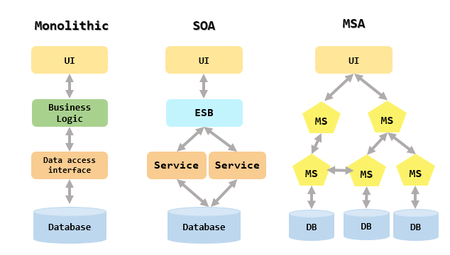

# Software Architectures

[출처](https://velog.io/@jungedlin/MSA-3)

## Monolithic Architecture

하나의 코드 베이스를 사용하여 여러 기능을 수행하는 소프트웨어 개발 모델

### 특징

- 간단한 서비스, 또는 프로토타입 설계에 적합

### 장점

- 통합 배포, 테스트가 용이
- 기획에 필요한 시간이 짧고 개발을 시작하기에 편리

### 단점

- 빌드, 배포 시간이 긺
- 유지보수가 어려움
- 모든 기능에 대해 하나의 언어, 프레임워크를 유지해야함

### 종류

#### Single Monolithic:

- 하나의 코드 베이스 내에서 모든 기능을 처리함
- 가장 대표적인 Monolithic 방식

#### Modular Monolithic

- 하나의 코드 베이스 내에서 모듈을 사용하여 로직을 나누는 방식
- Single Monolithic보다 유지 보수 및 개발이 쉬움
- 서비스가 커지면 모듈 관리가 복잡해질 수 있음

## Service Oriented Architecture(SOA)

공통의 통신 언어를 사용하는 인터페이스를 통해 소프트웨어 구성 요소를 재사용하는 개발 모델

### 특징

- ESB(Enterprise Service Bus) 등의 방식을 사용하여 인터페이스 간 통신을 구현
  > ESB: 분리된 서비스들 간의 요청과 처리를 중개하는 미들웨어

### 장점

- 개발된 기능을 공유하므로 재가용성이 높음
- 적응성이 높아 비즈니스에 맞춰 유연하게 활용할 수 있음

### 단점

- ESB의 유지보수가 어렵고 비용이 많이 듦

## Microservice Architecture(MSA)

소프트웨어를 작은 구성 요소, 또는 서비스로 분리하고 API로 통신하는 개발 모델

### 특징

- 복잡하고 규모가 큰 서비스 구성에 적합
- 주로 하나의 서버에서 데이터를 교환하기보다 API를 통해 통신
- 클라우드 환경에 적합

### 장점

- 코드의 유지보수가 쉽고 효율적임
- 코드의 재사용성이 높음
- 리소스를 선택적으로 할당함으로써 확장과 축소가 용이

### 단점

- 개발을 시작하기 전 많은 계획과 설계가 필요
- 서버 간 결합된 데이터의 경우 디버깅을 할 때 회의 과정이 필요

#### 추가 공부 내용

- Spring Cloud
- API Gateway
- Docker

#### 참고 자료

https://aws.amazon.com/ko/compare/the-difference-between-monolithic-and-microservices-architecture/
https://giljae.com/2022/10/13/Moduler-Monolithic-%EC%95%84%ED%82%A4%ED%85%8D%EC%B2%98.html
https://wooaoe.tistory.com/57
